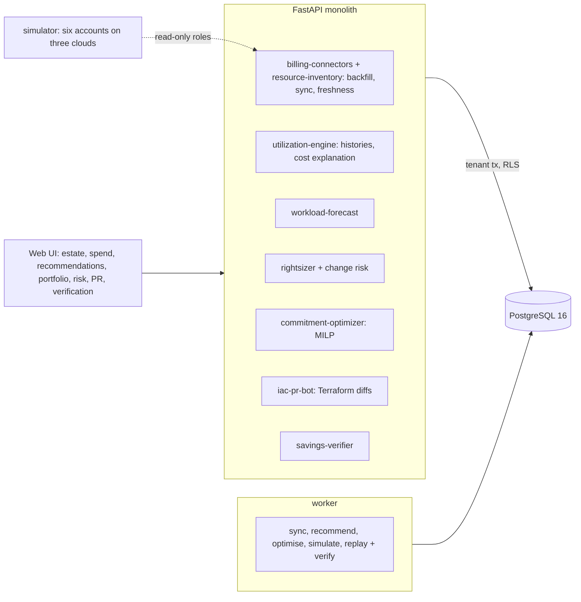

# Autonomous Cloud Cost Engineering & FinOps Optimization

For a platform or FinOps team running on several clouds: it connects the accounts with read-only roles, keeps an hourly view of
what every machine, node pool, database and volume does and costs, forecasts each workload, rightsizes only where the forecast
says the SLO will hold, sizes savings plans and reservations for the estate that will remain afterwards, writes the changes as a
Terraform pull request that a second person approves, and after the changes ship measures what they really saved.

Built from blueprint 05 of "Advanced Engineering Build Book, Volume IV" as a **vertical slice**: the demo scenario end to end,
with the platform parts real and the rest listed under [Not built](#not-built-and-why).

**The clouds, accounts, workloads, prices and bills come from a simulator in this repository. No real cloud account, API or
billing export is used, and nothing is ever applied to infrastructure. Changes and purchases are "shipped" by telling the
simulator, which is also what gives the savings verifier a true answer to be scored against; on a real bill the verifier would
carry errors (credits, private discounts, amortisation) that this simulator does not have.**

## Run it

```bash
docker compose up --build        # migrates, seeds, serves http://localhost:8270/ui/ with one worker
docker compose run --rm test     # 13 tests against a throwaway database
```

Open http://localhost:8270/ui/ and press **Run all steps** (the recorded run took 21 seconds through the API), or `make bootstrap demo`.
Demo tokens (local only): `acme-finops_lead-demo`, `acme-engineer-demo`, `acme-viewer-demo`. Run `make reset` before a second demo run.

## The demo, step by step

1. The simulated clouds start with eight weeks behind them: six accounts on AWS, Azure and Google Cloud (four production, two dev).
   Each is connected with a read-only role or identity reference; a connection that pastes an access key instead is refused
   (422 `secret_not_accepted`) before anything is stored. The backfill brings in 252 running resources, 13,788 daily billing lines and
   330,912 resource-hours of utilisation; the estate spent $122,012 in the last 30 days (compute $62,545, Kubernetes $43,192,
   databases $11,345, storage $4,931). Every account's inventory is 0.1 minutes old against a 15-minute policy.
2. Last week cost $28,945 against $28,293 the week before: +$503 of usage (mostly the ML training pool and a batch machine) and +$149
   of newly launched machines. The most expensive resource is the customer portal's Kubernetes pool: its floor of 10 nodes (160 vCPU)
   stays up all night although its demand at night would need 3.
3. The rightsizer forecasts every workload four weeks ahead and picks the smallest size whose p99 CPU stays under 80% and memory
   under 85% in 90% of sample paths. 72 recommendations are open, $19,825 a month: 41 resizes ($13,703), 11 idle machines to terminate
   ($2,536), 14 unattached volumes to delete ($772) and 6 node-pool floors to lower ($2,815; the portal pool's only from 10 to 9, see
   Measured). 6 resources are review tasks (too little history, or CPU pinned at 100%). The 14-day average-utilisation rule would make
   116 changes claiming $34,653 a month; the forecast gives the 78 where it goes further 67.2 expected SLO breaches. The spotlight is
   etl-01: 7.1% mean CPU, so the rule would shrink it from n2-standard-8 to n2-standard-2, but its nightly batch reaches 100% (P(breach)
   0.88). The change-risk model, trained on the estate's own history, scores AUC 0.992 on held-out resources; headroom alone scores 1.000
   here, a production/dev rule 0.567. No open change scores above 0.058.
4. One-year commitments for the estate after rightsizing, chosen by a mixed-integer programme over 20 scenarios of the next 13 weeks:
   savings plans of $61/h (AWS), $26/h (Azure) and $24/h (GCP), and 13 database reservations matched to the types that will run.
   Expected 13-week cost: $226,440 against $300,825 with no commitments and $244,050 for last month's minimum, which commits AWS at $76/h
   on usage the rightsizing removes and reserves five db.m6i.2xlarge where two will run: $20,405 of its fees would go unused against
   $2,026. New fees: $65,671 a month.
5. Three plans against 200 forecast sample paths of the next four weeks: the SLO-aware recommendations (72 changes, $19,825 a month,
   0.00 expected breaches), the average rule (116 changes, $34,653, 67.25 expected breaches) and an aggressive rightsizer aiming at 95%
   (78 changes, $22,818, 1.83 expected breaches and a 96.7% chance of at least one).
6. The 72 changes become unified Terraform diffs in six account repositories and a pull request with the evidence, risk and rollback.
   Applying directly is refused (403 `direct_mutation_disabled`); the proposing engineer cannot approve it (403 `proposer_cannot_approve`);
   the FinOps lead approves it and it is opened for the team's pipeline, and approves the commitment portfolio. Nothing in any cloud
   has changed.
7. The simulator is told the pipeline merged the pull request and the commitments were bought on 6 October; four weeks run. The
   verifier puts the old configurations back into each pricing pool and bills it again through the commitments in force: **$17,466**
   saved over 27 days (about $19,666 a month), against **$17,698** the simulation says (1.3% off). Before/after says $25,084 (+41.7%),
   difference-in-differences $15,651 (−11.6%), the list price $17,354 (−1.9%). The commitments saved $22,070, measured from the bill
   apart from the rightsizing. None of the 47 resized machines, databases and node pools broke its SLO; re-priced on-demand cost matches the bill within 0.08%.
   The fourth week after against the week before: $19,038 against $28,945 (−$3,154 configuration, −$5,864 commitments, −$1,146 removed
   resources, +$206 new, +$50 usage). The audit chain verifies.

## Architecture



| Piece | How it works |
|---|---|
| Simulator (`finops/world.py`) | Six accounts; machines (some on an office-hours schedule), node pools behind a cluster autoscaler (70% target, an hour behind demand, removing one node an hour), databases and volumes. Every workload's demand has a daily and weekly shape, growth, noise and spikes; the generator knows which are idle, oversized, bursty (nightly or weekly batch), month-end jobs, growing, memory-bound, or a volume attached only for a Sunday restore test. A price catalogue per cloud; savings plans and reservations allocated proportionally to eligible usage each hour, unused fees as their own lines. Demand belongs to the workload, never the configuration, and every draw is keyed by (seed, resource, day), so a period re-runs with or without a change on the same demand. |
| Connectors and inventory | A connection needs a role or identity reference in the provider's format; keys, secrets, URLs and mismatched accounts are refused. A sync stores the inventory snapshot, hourly utilisation (one 24-value array per resource-day) and daily CUR-style lines. |
| Workload forecast | Per resource: an hour-of-week profile of the last eight weeks times a weekly log-linear trend (Theil-Sen), and whole-day residuals bootstrapped into sample paths. Baseline: seasonal naive. |
| Rightsizer | The smallest size (at most two steps down) whose p99 CPU stays under 80% and memory under 85% in 90% of 100 paths; idle machines (no hour over 5% in the history) terminated; volumes unattached and without I/O for 28 days deleted; node-pool floors lowered while the autoscaler model adds under 0.5% hot hours. Abstains with a review task on under 14 days of history, CPU pinned at 100%, change risk above 0.25 or inventory older than 15 minutes. Baseline: the 14-day average-utilisation rule. |
| Change risk | Logistic regression on headroom at the new size, burstiness, growth, steps, history, kind, environment and the forecast's backtest error, trained by replaying every one- and two-size resize four weeks back against what followed. |
| Commitment optimizer | Savings plans per cloud in $1/h blocks and reservations per database type, as a MILP (OR-Tools SCIP) minimising expected cost over 20 scenarios of the next 13 weeks after the planned changes, optionally under a monthly fee budget. Baseline: last month's minimum. |
| SLO simulation | Each plan's changes replayed against 200 sample paths: probability of a breach per change, expected breaches, savings at risk. |
| IaC PR bot | Renders each account's Terraform from the inventory, applies the changes, emits unified diffs and the PR description. Proposals only: no write path to any cloud exists, a direct apply is refused by policy, and a second person approves. |
| Savings verifier | Rebuilds hourly on-demand spend per pricing pool from utilisation and the catalogue (checked against the bill), adds back the old configurations' cost, and bills each pool again through the commitments in force. Beside it: before/after, difference-in-differences against untouched resources, the list price; the SLO as it actually held after the change; commitment savings straight from the bill. |
| Platform | Row-level security per tenant on every table, Postgres job queue with retries and a dead-letter view, Idempotency-Key replay, hash-chained audit log, model artifacts with metrics and data snapshot, every inference logged with model version and input hash, `/metrics`. |

## Data model

`migrations/002_finops.sql` follows the blueprint (cloud_account, resource, resource_metric, cost_line, commitment, recommendation,
simulation, change_request, savings_measurement, policy); additions are marked `(+)`: the estate's seed, clock and what the simulator
was told, recommendation runs, commitment portfolios, model artifacts and runs, and each billing line's pricing pool. Utilisation and
billing lines are partitioned by month; partitions are reachable only through the parent's tenant policy (the blueprint: no unbounded
telemetry in the OLTP tables; in production they belong in a columnar store).

## API

| Method | Endpoint | Purpose |
|---|---|---|
| POST | `/v1/accounts/connect` | Connect an account with a read-only role reference (never a key); 202 + job: backfill inventory, utilisation and billing |
| GET | `/v1/costs/explain` | A period against an earlier one: usage, configuration, rate, new and removed resources, biggest movers, totals by service, account or resource |
| POST | `/v1/recommendations/run` | 202 + job: forecast, SLO-constrained rightsizing and change risk over every resource, with the average rule's view beside it |
| POST | `/v1/simulations` | 202 + job: SLO risk of alternative plans over forecast sample paths |
| POST | `/v1/iac/pull-request` | Terraform diffs per repository and the pull request, a draft until a second person approves; `apply: true` refused by policy |
| GET | `/v1/savings/verified` | Verified savings of applied change requests by method, per resource, the SLO as it held, commitment savings from the bill |
| POST | `/v1/commitments/optimize` · `/v1/commitments/{id}/approve` | (+) 202 + job: the MILP portfolio against last month's minimum; a second person approves |
| POST | `/v1/change-requests/{id}/approve` · GET `/v1/change-requests/{id}` | (+) Approve (open) or reject a pull request; the proposer cannot |
| GET | `/v1/estate/overview` · `/v1/accounts` · `/v1/resources` · `/v1/resources/{id}` · `/v1/recommendations` · `/v1/policy` | (+) Command centre, freshness, inventory, drill-down with forecast band |
| POST | `/v1/simulator:start` · `/v1/simulator:advance` | (+) Start the simulated clouds; run days forward, optionally telling the simulator a PR was merged and commitments bought (202 + job) |

Contract: [`docs/openapi.json`](docs/openapi.json).

## Measured

[`docs/evaluation.md`](docs/evaluation.md) (`python -m finops.evaluate`, three estates the demo never uses, eight weeks of history and
thirteen after) and [`docs/performance.md`](docs/performance.md).

| Component | Result | Baseline |
|---|---|---|
| Workload forecast, four weeks, WAPE | 0.076–0.079 | seasonal naive 0.113–0.127 |
| … true p99 under the forecast's 90% path p99 | 90.4–91.0% (the target is 90%) | |
| Rightsizing false-positive rate (blueprint bar: 10%) | 0 of 267 (0.0%), $21,999–25,758 a month | 14-day average rule 213 of 420 (50.7%), $36,762–44,954 claimed, $13,012–14,527 of it safe |
| Change-risk AUC on the weeks after | 0.972–0.993 | headroom alone 0.955–0.983; environment/kind rule 0.607–0.643 |
| Commitment regret over 13 weeks | 0.5–1.2% of hindsight best, $230–549 unused fees | last month's minimum 2.9–5.5%, $10,487–15,978 unused |
| Verified savings, attribution error (blueprint bar: 5%) | 0.7–1.5% | list price 2.2–8.8%; difference-in-differences 25.4–56.3%; before/after 31.8–37.0% |
| Inventory freshness (blueprint bar: 15 min) | incremental sync of six accounts in 72–117 ms; stale accounts become review tasks | |
| No direct infra mutation | no write path to any cloud; `apply` refused by policy; approval opens a PR only (tested) | |

Three things these numbers say plainly. The rightsizer's zero false positives are bought with caution, not cleverness alone: it sizes
to the 90th percentile of the forecast's p99, and the evaluation's breach line sits 10 points above its target, so it leaves money
the aggressive plan in the demo would take ($22,818 against $19,825 a month, at 1.83 expected breaches). The change-risk model adds
little to the forecast headroom the rightsizer already uses; it earns its place as a calibrated probability on each change (mean
predicted 0.66–0.69 against 0.66–0.70 observed) rather than as better ranking. And the verifier's error under 2% is a best case: it
re-prices with the same catalogue and allocation rule the simulator bills by; what the comparison does show is how wrong the common
methods are when commitments ship in the same month as rightsizing.

## The hardest tradeoff

What a dollar of rightsizing is worth once commitments exist. Committing first locks in the waste; rightsizing first makes last
month's usage the wrong thing to commit to, which is exactly the baseline's 3–6% regret and its $10–16k of unused fees. So the
portfolio is sized on a forecast of the estate after the planned changes, and the same coupling decides how savings are counted
afterwards: under a fixed savings plan, usage removed above the commitment saves full on-demand price and usage removed inside an
under-used one saves nothing, so neither the list price nor the average discounted rate is right. The verifier therefore bills every
pricing pool twice, hour by hour, with and without the changes. The cost is that it has to model what it cannot see once a change has
shipped, the old configuration's behaviour; for node pools that is the autoscaler, and the service's model of it (which does not
know the real one removes nodes gradually) is also why the portal pool's floor drops only from 10 to 9 nodes, though nights need 3:
the model predicts hot hours during the morning ramp that the real autoscaler would mostly absorb.

## Threat model (summary)

| Threat | Mitigation here | Gap |
|---|---|---|
| Cloud credentials leaking through the service | Only role or identity references are accepted; key-shaped values, extra fields and URLs are refused and never stored; connections audited | No real assume-role, external ID or credential rotation |
| An automated change to production infrastructure | No write path to any cloud; `apply` refused unless policy allows it (it does not by default); a PR needs a second person; risky and stale recommendations become review tasks; everything in the hash-chained audit log | One approver; the team's pipeline is trusted to apply what was approved |
| A commitment bought on a bad forecast | Portfolios are proposals with their baseline and expected cost; only a FinOps lead who did not propose one approves; nothing is bought by the service | No term-length risk model beyond 13 weeks |
| One customer seeing another's spend | Row-level security on every table, partitions closed to the app role, tested through the API and in the database | |
| A model nobody can trace | Every inference logs model version and an input hash; the risk model is registered with its held-out metrics and data snapshot | No promotion workflow beyond `approved` |

## Not built, and why

- **Real connectors (AWS CUR and Cost Explorer, Azure Cost Management, GCP billing export, the cloud SDKs, Prometheus, OpenTelemetry)**:
  the simulator stands in for all of them; the slice proves what happens after the data lands.
- **Applying anything**: by design. The PR bot produces diffs; merging, `terraform plan` and apply belong to the customer's pipeline,
  and the blueprint's "no direct infra mutation by default" is enforced by having no write path at all. Bounded automation is a
  policy flag that is off and untested beyond its refusal.
- **Three-year terms, convertible reservations, spot, storage tiering, data transfer**: one-year savings plans and database
  reservations make the portfolio a real MILP; a three-year term needs a model of the estate over three years that 21 simulated weeks
  cannot score.
- **A deep forecaster**: a seasonal profile with a trend and bootstrapped residuals is calibrated here (90.4–91.0% against a 90% target)
  and beats seasonal naive by a third; the simulator has no structure left for a bigger model to find.
- **Kafka, ClickHouse, object storage, Kubernetes, Terraform for the platform itself, OIDC/SSO, SSE progress, a React front end**: not
  needed to prove the slice (jobs are polled). No cloud account used.

## Commercial sketch

Buyers: SaaS companies, enterprises, MSPs and platform engineering teams. Pricing shape from the blueprint: a platform fee plus a
percentage of verified savings, which is why verification is a first-class service here and why it keeps rate savings (commitments)
apart from usage savings (rightsizing): a buyer pays on what the verifier signs, so it has to be the number that survives an audit.

## Layout

```
core/        platform kit: db + RLS, jobs, audit chain, HTTP, scenario runner, load test
finops/      world (the clouds), engine (forecast, rightsizer, risk, MILP, verifier, explain), api, seed, evaluate
migrations/  forward-only SQL          web/   UI, scenario.json, demo.json (recorded run)
tests/       13 tests                  docs/  evaluation.md, performance.md, openapi.json
```
