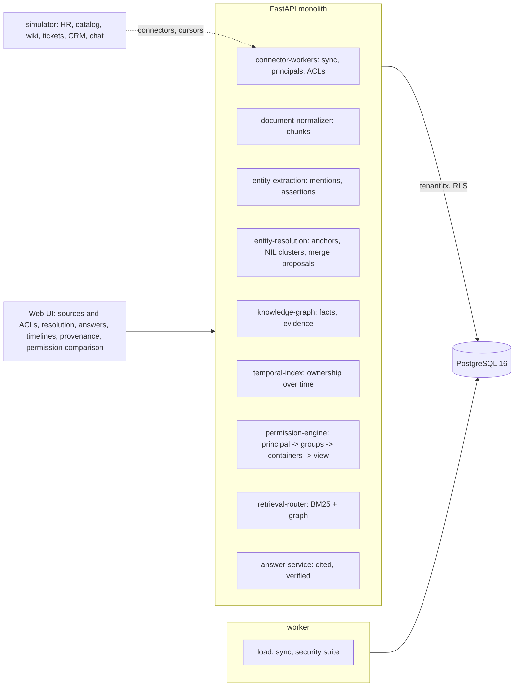

# Enterprise Knowledge Graph Operating System

For a company whose knowledge is spread across an HR directory, a service catalog, a wiki, a ticket tracker, a CRM and a chat
tool: it syncs all six with their permissions, reads every document for the people, teams, services, vendors and decisions in
it, works out which names mean the same thing, reconciles who owned what and when, and answers questions with a citation for
every sentence, built only from what the person asking is allowed to read, through every door (search, graph queries,
answers, entity pages and provenance).

Built from blueprint 07 of "Advanced Engineering Build Book, Volume IV" as a **vertical slice**: the demo scenario end to end,
with the platform parts real and the rest listed under [Not built](#not-built-and-why).

**The company, its people, documents and permissions come from a simulator in this repository. No real enterprise data is used,
and no language model or outside API is called: extraction, entity resolution and answers are deterministic models trained
and scored here. The corpus is generated from templates with varied wording, so the extraction and answer numbers show the
pipeline works and where it beats its baselines on this corpus, not how it would read real prose.**

## Run it

```bash
docker compose up --build        # migrates, seeds, serves http://localhost:8290/ui/ with one worker
docker compose run --rm test     # 14 tests against a throwaway database
```

Open http://localhost:8290/ui/ and press **Run all steps** (the recorded run took 34 seconds through the API), or `make bootstrap demo`.
Demo tokens (local only): `halden-steward-demo` (Morgan Lee), `halden-analyst-demo` (Ines Duarte, procurement), `halden-viewer-demo`
(Samuel Okafor, site reliability). The token's role decides what a person may *do*; their groups, synced from the HR system, decide
what they may *read*. Run `make reset` before a second demo run.

## The demo, step by step

1. An invented company, Halden Systems: 106 people in 16 groups, six source systems holding 2,165 objects in 37 containers with
   their own ACLs. The extractor and the linker are trained on 318 annotated documents and scored on 102 held out: extraction
   precision and recall 0.973 / 0.973 against 0.825 / 0.892 for trigger words; the linker picks the right anchor for 95 of 100
   mentions, none wrong. One full connector sync: 3,028 chunks, 4,739 entity mentions (4,477 linked to the HR directory, catalog
   or CRM, 44 where the linker abstained), 1,108 assertions reconciled into 563 facts, queryable 6.1 s after the request. The
   steward can read 31 containers, the procurement analyst 17, the on-call engineer 22, and the matrix shows which.
2. Who is who: "p. raman" is Pradeep Raman in one document and Priya Raman in three others, told apart by the document each sits
   in; the two Daniel Kims stay apart; Jonathan Pike appears in seven forms (full name, first name, initial, email, handle,
   nickname, a typo). Two teams were renamed, and the corpus says so, which makes them merge *suggestions*: the analyst proposes
   merging Data Platform into Analytics Engineering, her own approval is refused (403), and the steward approves: 21 mentions
   and 16 assertion arguments move, and the facts are re-derived.
3. The analyst asks why Ember Observability was selected. Seven sentences, each with its citations, all seven verified: selected
   on 2025-10-29; reasons SOC 2 Type II with EU data residency and the lowest three-year cost; decision owner Dana Whitfield;
   Wren and Cinder also considered; Wren rejected because its pricing was 30% higher; Cinder because it failed the security
   review (and, in the private channel, because its pricing was 40% higher). Search shows each chunk's rank in BM25 and in the
   graph.
4. The generator is told rate-limiter fails from tomorrow; two days pass. The incremental sync fetches only the 10 objects that
   changed (9 chat messages, 1 ticket) and they are queryable 2.6 s after the request. The on-call engineer asks who owns
   rate-limiter: Messaging since 2026-05-02, Search & Discovery before, led by Rosa Tanaka; one source still names another owner,
   "rate-limiter service overview", edited 2026-08-10 and still saying Search & Discovery; the latest incident is INC-9325.
   All five sentences verified. In March 2026 it was Search & Discovery.
5. Provenance: the selection rests on the private channel and the evaluation page; the ownership on the handover announcement
   and page, three tickets and a chat line, with the stale page listed as contradicting. Each with its sentence, extractor and
   confidence, the source's system, container, version, hash and sync time, and how every name in it was resolved.
6. The engineer asks the same vendor question and gets two sentences, from the engineering announcement alone (selected; one
   reason), with no hint that more exists. Asked the contract price he gets an abstention; the analyst gets $455,000 a year.
   His search for the rejected vendor's security finding returns nothing restricted; the provenance of an evaluation fact is a
   404 identical to a fact that does not exist; the vendor's graph shows him the decision and its announced reason, where the
   analyst also sees both rejected vendors and the decision owner.
7. The security suite: 23 principals (every distinct set of readable containers), 9,303 probes through search, answers, graph,
   entities and provenance, **0 leaks**; 336 of 336 non-interference checks identical; the same probes with the permission
   filter off leak 1,001 times of 1,198. Then the hash-chained audit log.

## Architecture



| Piece | How it works |
|---|---|
| Simulator (`ekg/world.py`) | Fourteen teams (two renamed mid-way), 106 people (two pairs who share an initial and a surname plus two more, two people with the same full name, nicknames, typos), 45 services whose owners change, ten procurement decisions with three candidates each. Six source systems with containers and ACLs: procurement's space, the private evaluation channels, the security reviews and the contracts are restricted. Service pages that go stale after a handover (sometimes edited since), a catalog that catches up late, chat that misremembers, hedges and questions that look like facts. Every document carries its truth (mention spans, what each sentence asserts); a fifth of the free text is exported as the annotation set. Keyed randomness: one seed, one company. |
| Connectors | A sync pulls each system from its cursor (or everything), with the users, groups and container ACLs; unchanged objects are skipped by content hash, changed ones replace their chunks, mentions and assertions. |
| Extraction | Mentions: the HR directory, catalog and CRM as gazetteers, plus patterns (emails, handles, initials, kebab-case service names, legal suffixes, "the X team", shortlists) learned in a first pass. Relations: every candidate pair in a sentence scored by a logistic regression over the words between and around them, trained on the annotations; structured records parsed by schema; reasons, prices and renames by pattern. Baseline: trigger words. |
| Entity resolution | Each mention scored against its blocked candidates by a logistic pair scorer that reads the mention in its own document (its channel, the teams, services and people around it) together with the candidate's profile; link above 0.5 with a margin of 0.2, abstain when two candidates score alike, NIL clusters for names no structured source lists. Renames stated in the corpus become merge suggestions; a person proposes, another approves. Baseline: string equality. |
| Temporal reconciliation | A service's owner over time by Viterbi decoding over days: each dated assertion is evidence weighted by its source's reliability (catalog revision .95, ticket .92, chat .75, service page .65), a change of owner costs a constant, a stated handover makes it free on its effective day. Baselines: latest mention, majority of mentions. |
| Permission engine | Principal -> groups -> containers whose ACL names a group. Every read builds a view of the index holding only the rows of those containers, before anything is ranked; BM25 statistics, the LSA basis, entity aliases and names, facts and timelines are all computed inside the view, so a view answers exactly as an index built without the restricted objects would (checked). |
| Retrieval | BM25 and graph expansion (chunks that are evidence for facts about the entities the query names, one hop out) fused by reciprocal rank. LSA per view is built and measured but left out of the default: it lowered recall here. |
| Answers | Intents (owner now or on a date, why a vendor was chosen, price, lead) answered from the view's facts only; every sentence carries the facts it states and the chunks it cites; a separate verifier re-reads each citation; nothing supported means an abstention, worded the same whether the evidence is restricted or absent. |
| Platform | Row-level security per tenant on every table, Postgres job queue with retries and a dead-letter view, Idempotency-Key replay, hash-chained audit log, model artifacts with metrics and data snapshot, every extraction and linking batch logged with model version and input hash, every query in `query_audit` (hashed, with the sources returned, misses included), `/metrics`. |

## Data model

`migrations/002_ekg.sql` follows the blueprint (source_system, source_object, principal, entity, entity_alias, relationship,
evidence, permission_edge, embedding, temporal_fact, query_audit); additions are marked `(+)`: the corpus (seed, clock, what the
generator was told, index version), document chunks, mentions, merge proposals, sync runs, model artifacts and runs.
`relationship` holds every assertion read from a sentence; `temporal_fact` the reconciled facts over every container with
their `evidence`; each reader's facts are re-derived from the assertions they may read. `embedding` holds LSA vectors per
permission view.

## API

| Method | Endpoint | Purpose |
|---|---|---|
| POST | `/v1/connectors/sync` | 202 + job: full or incremental (from each system's cursor) sync with principals, groups and ACLs; normalise, extract, resolve, reconcile |
| GET | `/v1/entities/{id}` | An entity as the caller may see it: aliases, facts, ownership timeline with its dated evidence; 404 when nothing they may read mentions it |
| POST | `/v1/search` | Search inside the caller's view (BM25 + graph by default; `hybrid+lsa`, `bm25`, `vector`, `graph`), each hit with its rank per retriever |
| POST | `/v1/graph/query` | An entity's neighbourhood (depth 1-2, predicates, as of a date) in the caller's graph |
| POST | `/v1/answers` | A cited, verified answer from the caller's facts, or an abstention |
| GET | `/v1/facts/{id}/provenance` | Supporting and contradicting assertions, chunks, sources (version, hash, sync), resolutions, merges |
| GET | `/v1/overview` · `/v1/entities?q=` · `/v1/resolution` | (+) Command centre for the caller's view, lookup by name, resolution and the merge queue |
| POST | `/v1/merges` · `/v1/merges/{id}/approve` | (+) Propose a merge; a steward who did not propose it approves |
| POST | `/v1/corpus:load` · `/v1/simulator:advance` · `/v1/security/suite` | (+) Create the simulated enterprise and train; move it forward, optionally telling it a service fails; 202 + job: the security suite |

Contract: [`docs/openapi.json`](docs/openapi.json).

## Measured

[`docs/evaluation.md`](docs/evaluation.md) (`python -m ekg.evaluate`, three companies the demo never uses) and
[`docs/performance.md`](docs/performance.md).

| Component | Result | Baseline |
|---|---|---|
| Extraction from free text, precision / recall | 0.957–1.0 / 0.971–0.992 | trigger words 0.799–0.839 / 0.853–0.882 |
| Entity resolution, B³ F1 (blueprint bar: 0.95) | 0.977–0.981 (precision 0.999); 0.985–0.988 after the rename merges are approved | string equality 0.724–0.729; fuzzy match 0.869–0.885 |
| Owner of a service that changed hands, every month | 95.7–99.3% | latest mention 90.8–96.4%; majority 85.1–85.4% |
| … today | 100% | latest mention also 100% |
| Retrieval recall@10 / MRR, reader with every container | 0.691–0.714 / 0.893–0.934 | BM25 0.327–0.360 / 0.634–0.645; adding LSA lowers both |
| Answers: owner today, why a vendor was chosen, its reasons | 135 of 135, 30 of 30, 60 of 60 | |
| Owner in a past month | 36 of 39 | |
| Citation coverage (blueprint bar: 100%) | 100% of 1,391 answer sentences (both readers), by a separate verifier | |
| Questions about things that do not exist | 30 of 30 abstained (both readers), no claims | |
| Permission leakage (blueprint bar: 0) | 0 in 34,563 probes over 86 principals; non-interference 720 of 720 | same probes, filter off: 2,660 of 2,888 leak |
| Incremental sync (blueprint bar: 5 min) | 10 changed objects queryable 2.6 s after the request; 79 objects 2.7 s | |
| Answer latency | p50 52 ms, p95 56 ms | |

Three things these numbers say plainly. The extraction and answer numbers are high because the text comes from templates this
repository wrote; they show the hedges and "budget owner" traps that fool trigger words, not robustness to real prose. The
graph, not the vector model, is what lifts retrieval: LSA fitted per view is worse than BM25 alone here and drags the fusion
down, because the sentence that holds the reasons for a decision often never names the vendor, which a graph knows and a
co-occurrence model does not. And on today's owner the reconciliation is no better than taking the latest mention on these
corpora; it earns its place in the months around a handover, which is when people ask.

## The hardest tradeoff

Where the permission filter goes. Filtering the results after ranking is the easy design, and it leaks in ways that never show
in a result list: the document frequencies that weight a search term, the basis of a vector model, the alias table that turns a
question into an entity, the dates a reconciled fact was given, all of them carry what restricted documents say. Here every
statistic is computed inside the reader's view, from the rows they may read, which the suite checks by comparing their
results with an index built without the restricted objects (identical, 720 of 720 checks). The cost is real: per-view caches
instead of one index, an LSA basis per set of readable containers, facts re-derived per view (so two people can see different
start dates for the same fact), and the in-process index that makes this cheap would have to become a per-view search service
at enterprise scale. The alternative is a system whose answers are correct and whose numbers quietly describe documents the
reader was never allowed to see.

## Threat model (summary)

| Threat | Mitigation here | Gap |
|---|---|---|
| A reader extracts a restricted fact (search, answers, graph, entity, provenance) | Container ACLs synced from the sources; every read through a view filtered before ranking; a fact is visible only with visible evidence; 404 identical to not found; suite with 0 leaks and a filter-off control | Entity resolution and extraction are tenant-wide: which entity a public name links to may use the HR directory and catalog the reader cannot read |
| Side channels: counts, statistics, embeddings | BM25 statistics, LSA basis, aliases, names and facts computed per view; non-interference checked | Timing differences not measured; sync-run counts shown to analysts and stewards are tenant-wide |
| A wrong merge joins two people or teams | Renames are suggestions; a merge needs a proposer and a different steward; audited; old ids resolve to the kept entity | No unmerge endpoint yet |
| An answer stating what its sources do not say | Answers only from facts; every sentence cites; a verifier re-reads citations; abstention otherwise | Template answers only for known intents; free questions fall back to quoting chunks |
| One tenant seeing another's knowledge | Row-level security on every table, tested through the API and in the database | |
| A query nobody can trace | `query_audit` per query (hashed text, view, sources returned, misses), model versions on every inference batch | Query text itself is not kept |

## Not built, and why

- **An LLM extractor or answer writer**: the brief for this slice was deterministic and local. Extraction is a gazetteer, patterns
  and a logistic model over this corpus's annotated fifth; answers are templates over facts. On real prose an LLM extractor
  would earn its place (recall on wording no pattern anticipated), behind the same verifier and permission view; the numbers
  here would not transfer.
- **A neural cross-encoder for resolution and dense embeddings**: the logistic pair scorer reads mention and candidate together
  and reaches 0.977–0.981 B³ F1 with precision 0.999; LSA, the local vector model tried, lowered retrieval recall, so a dense
  model is the next thing to try on real text, not a missing piece here.
- **Neo4j, OpenSearch, pgvector, Kafka/NATS, object storage, ClickHouse**: Postgres tables and an in-process index per API worker
  are enough for 2,200 objects; at enterprise volume the per-view index is the first thing to move out.
- **Real connectors (Workday, GitHub, Confluence, Jira, Salesforce, Slack), SSO/SCIM, SSE progress, a Next.js front end,
  Kubernetes, Terraform**: the simulator stands in for every source; jobs are polled. No cloud account used.

## Commercial sketch

Buyers: large enterprises, consulting firms, regulated organisations. Pricing shape from the blueprint: platform plus indexed
object volume plus enterprise connectors. The permission guarantee is the part a regulated buyer pays for, which is why the
security suite runs as a job anyone with the steward role can rerun, with its filter-off control.

## Layout

```
core/        platform kit: db + RLS, jobs, audit chain, HTTP, scenario runner, load test
ekg/         world (the company and its sources), engine (extraction, resolution, reconciliation, views, retrieval, answers,
             security suite), api, seed, evaluate
migrations/  forward-only SQL          web/   UI, scenario.json, demo.json (recorded run)
tests/       14 tests                  docs/  evaluation.md, performance.md, openapi.json
```
