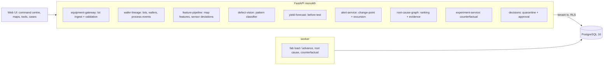

# Semiconductor Fab Yield Intelligence & Defect Root-Cause

For a fab's yield engineering team: it watches every chamber's sensors for drift, classifies every wafer's test map into
defect patterns, predicts each wafer's yield before test, ranks the chambers behind an excursion with the evidence for each,
proposes a quarantine that a second person approves, and re-runs the exposed lots to show what a recipe change would have saved.

Built from blueprint 01 of "Advanced Engineering Build Book, Volume IV" as a **vertical slice**: the demo scenario end to end,
with the platform parts real and the rest listed under [Not built](#not-built-and-why).

**The fab, its lots, sensors and test maps come from a simulator in this repository. No real fab data is used. The
counterfactual re-runs the same simulator, so its numbers are as right as the simulator's physics, which here is the truth;
on a real fab it would be a model of the physics and the comparison would carry its error.**

## Run it

```bash
docker compose up --build        # migrates, seeds, serves http://localhost:8230/ui/ with one worker
docker compose run --rm test     # 12 tests against a throwaway database (about 35 s)
```

Open http://localhost:8230/ui/ and press **Run all steps** (about 35 seconds), or `make bootstrap demo`.
Demo tokens (local only): `fab-yield_manager-demo`, `fab-process_engineer-demo`, `fab-viewer-demo`. Run `make reset` before a second demo run.

## The demo, step by step

1. An invented fab: 16 tools and 27 chambers across litho, etch, deposition, CMP and implant, after eight weeks: 448 lots of 25
   wafers, 11,200 wafers, 6.0 million die measurements, each wafer with a sensor summary per step and a 540-die test map. The
   models are trained on six weeks and scored on the last two: the pattern classifier's macro-F1 is 0.97 against 0.67 for a
   nearest-centroid baseline; yield before test is off by 0.84 points against 0.94 for the product's trailing mean, and by 2.1
   against 5.6 on excursion wafers.
2. A normal wafer as the classifier sees it, and etch tool ETCH-03's three chambers against their qualified baselines.
3. The generator is told that chamber ETCH-03/B starts running hot four lots from now, climbing 0.22 °C a lot. Forty lots run.
4. The drift detector raises its alert on ETCH-03/B at lot 453, four lots before the first edge ring is tested (lot 457). The
   excursion alert follows at lot 464 when edge rings pile up. Yield on the lots through ETCH-03 sags from about 96.5% to 91–92%.
   A partner lot arrives through the gateway: one accepted and scored, one refused for an unknown chamber.
5. Root cause ranks all 27 chambers: ETCH-03/B first with confidence 1.00. 70 of the 96 wafers it ran in the window have edge
   rings against 0% on its two sibling chambers that ran the same lots (Fisher p = 1e-84), its sensor had a change-point, and
   96% of the history's edge rings came from etch. Its drift is estimated at +3.71 °C; 11 lots are exposed since the change-point.
6. The process engineer proposes quarantining the 11 lots and holding the chamber; their own approval is refused; the yield
   manager approves. The lots are quarantined and new lots are routed around ETCH-03/B.
7. The exposed lots re-run wafer by wafer: as they ran (identical, the check), with a recipe offset of −3.71 °C, and with the
   chamber routed around. The offset lifts mean yield from 93.0% to 95.7% and 3,886 good dies, but leaves 24 edge-ring wafers:
   it is tuned to today's drift and over-cools the lots that ran before the drift had grown. Routing around recovers 96.6% and
   5,238 dies ($220k at $42 a die) with no edge rings. Then the yield model on the next lots, and the audit trail.

## Architecture



| Piece | How it works |
|---|---|
| Simulator (`fab/world.py`) | Lots of 25 wafers go through five steps; a lot is dispatched to one tool per step and its wafers spread across that tool's chambers. Each wafer-step leaves a sensor summary (each chamber has its own calibration offset; each product its own setpoints). Faults move a chamber's primary sensor, and the defects follow the sensor: an etch chamber off temperature rings the edge, a worn CMP pad hits the centre, a litho focus drift makes a donut, a deposition flow or implant dose fault raises defects everywhere. Scratches, particle clusters and incoming-material variation happen on their own. Every random draw is keyed by lot and wafer, which is what makes the counterfactual paired. |
| Chamber baselines | Median and robust spread of every sensor per chamber and product over the qualification week (clean by construction): a chamber's history is never its own reference, because a drifting chamber would hide in it. |
| Pattern classifier | Rotation-invariant features of the fail map (radial profile, sorted sector rates, the largest connected cluster and its elongation) into gradient-boosted trees; below 0.6 confidence, or a wafer called normal that fails like nothing normal, goes for review. |
| Yield before test | Gradient-boosted regression on every step's sensor deviations from the chamber's baseline, in the sensor's units; baseline: the product's trailing 20-lot mean. |
| Drift detection | Bayesian online change-point detection (Adams & MacKay) on each chamber's primary sensor, after every lot: an alarm when the probability of a fresh run is above 0.5 and the shift above 2 sd. Baseline: Shewhart 3-sigma. |
| Excursions | Eight wafers with one pattern in the last eight lots, including the latest. |
| Root cause | Every chamber scored by commonality with the affected wafers *within its own step* (log-odds and Fisher's test against the chambers that could have run the same wafers), a change-point on its sensor, and P(step \| pattern) learned from the history's labelled wafers; softmax confidence; the lots exposed since the change-point; the drift in sensor units. |
| Counterfactual | The exposed lots re-run through the simulator with the same per-wafer randomness, as they ran and under each alternative (a recipe offset, a chamber routed around); classified with the production model; good dies and value. |
| Decisions | A quarantine is proposed with its rationale; only a yield manager who did not propose it can approve; then the lots are quarantined and the chamber held. |
| Platform | Row-level security per tenant on every table, Postgres job queue with retries and a dead-letter view, Idempotency-Key replay, hash-chained audit log, model artifacts with metrics and data snapshot, every inference logged with model version and input hash, `/metrics`. |

## Data model

`migrations/002_fab.sql` follows the blueprint (fab, tool, chamber, recipe, lot, wafer with its die measurements, process_event,
model_run, root_cause_case, decision_record); additions are marked `(+)`: alerts, scenarios, chamber baselines, and the fab's
seed, clock and what the generator was told. Die results are one bounded array per wafer in a fixed die order, never a row per die.

## API

| Method | Endpoint | Purpose |
|---|---|---|
| POST | `/v1/lots/ingest` | Lots from the equipment gateway: route, sensors, die map; validated per lot, then scored and checked like any other |
| GET | `/v1/wafers/{id}/map` | Die map, the classifier's call, confidence, model version and the route |
| POST | `/v1/analysis/root-cause` | 202 + job: every chamber ranked for an excursion, with evidence, confidence, exposed lots and drift |
| POST | `/v1/models/yield/predict` | Yield before test for a lot's wafers, with model version and input hashes |
| POST | `/v1/scenarios/counterfactual` | 202 + job: the exposed lots re-run under alternatives |
| GET | `/v1/tools/{id}/health` | Chambers, baselines, sensor deviations, change-point probability, alarms |
| GET | `/v1/fab/overview` · `/v1/lots/{id}` · `/v1/alerts` | (+) Command centre, lot drill-down, alerts |
| POST | `/v1/cases/{id}/quarantine` · `/v1/decisions/{id}/approve` | (+) Propose, then a second person approves |
| POST | `/v1/fab:load` · `/v1/fab:advance` | (+) 202 + job: load the fab; run more lots, optionally telling the generator about a fault |

Contract: [`docs/openapi.json`](docs/openapi.json).

## Measured

[`docs/evaluation.md`](docs/evaluation.md) (`python -m fab.evaluate`, three fabs the demo never uses, 14 excursions each) and
[`docs/performance.md`](docs/performance.md).

| Component | Result | Baseline |
|---|---|---|
| Pattern classifier, macro-F1 on the test weeks | 0.86–0.94 | nearest centroid 0.54–0.69 |
| The same, trained on one fab and applied to another | 70–100% recall per pattern; 0.6–0.8% of normal wafers flagged | |
| Yield before test, error | 0.81–0.92 points (blueprint bar: 2.5) | trailing mean 0.82–1.25 |
| … on excursion wafers | 2.3–2.5 points | trailing mean 9.8–11.5 |
| Drift detected | 42 of 42 detectable excursions, median 1–2.5 lots | Shewhart 39 of 42, 1 lot |
| Drift false alarms per 1,000 runs | 0–0.12 | Shewhart 3.3–3.8 |
| Root cause, top-3 recall | 100% of 40 (top-1 98%; blueprint bar: 85%) | commonality alone 98% |
| Ingestion | ~51,000 die measurements a second, one process | blueprint target ~167,000 |

Three things these numbers say plainly. Root cause is mostly commonality: once the comparison is made within each step, the
chamber stands out, and the change-point and prior only break ties (one in 40). The change-point detector earns its place not by
speed, which a 3-sigma rule matches, but by raising a few percent of the false alarms, which is what lets someone read the alerts.
And the classifier is only as good as its labels: a pattern the training weeks saw once is the weak spot in the cross-fab test.

## The hardest tradeoff

Whose baseline a chamber is judged against. The easy choice is each chamber's own recent history, which is what a control chart
does; but a chamber that drifts slowly drags its own reference with it, and the first version here did exactly that, so a chamber
faulty for a third of its runs looked normal. Baselines here come from a qualification window, per chamber and per product (each
product's recipe runs its own setpoints, and mixing them made every product change look like a drift). The cost is that a
baseline goes stale after maintenance or a recipe change and has to be requalified on purpose; the alternative hides exactly the
slow drifts this system exists to catch.

## Threat model (summary)

| Threat | Mitigation here | Gap |
|---|---|---|
| A forged or malformed lot from the gateway | Every lot validated on its own: known chambers for each step in order, chambers on hold refused, sensor sets, die-map length and bins; duplicates refused; every ingest audited | No signing of equipment messages beyond the API token |
| A quarantine or hold without a decision | A proposal does nothing; only a yield manager approves, never the proposer; both in the hash-chained audit log | One approver |
| One fab seeing another's yield (a foundry's customers) | Row-level security on every table, tested through the API and in the database | |
| A model nobody can trace | Every inference logs model version and an input hash; artifacts carry their data snapshot and metrics | No promotion workflow beyond `approved` |

## Not built, and why

- **A CNN or vision transformer on the wafer maps, and inspection imagery**: rotation-invariant features into gradient-boosted
  trees reached 0.86–0.94 macro-F1, and the misses are labels, not capacity. A CNN earns its place with real maps and pattern
  variety this simulator does not have; there are no images to inspect here.
- **A temporal autoencoder for tool drift**: one sensor per chamber drives the faults in this world, and a change-point detector
  on it catches all of them; multivariate drift needs a world where faults show across sensors.
- **Causal DAG discovery**: the process order is known and commonality within each step plus the change-point found 40 of 40.
- **Kafka, Flink, Spark, ClickHouse, Iceberg, Neo4j, MLflow, Kubernetes, Terraform, a Next.js front end, SSO**: not needed to
  prove the slice; ingestion throughput would need some of them (see Measured). No cloud account used.

## Commercial sketch

Buyer: fabs, foundries and IDMs' yield engineering. Pricing shape from the blueprint: an annual fab licence plus a connected-tool
tier. The counterfactual is the ROI line a buyer asks for: dies a faster decision would have saved, in their own die price.

## Layout

```
core/        platform kit: db + RLS, jobs, audit chain, HTTP, scenario runner, load test
fab/         world (the fab), engine (features, models, change-points, root cause), api, seed, evaluate
migrations/  forward-only SQL          web/   UI, scenario.json, demo.json (recorded run)
tests/       12 tests                  docs/  evaluation.md, performance.md, openapi.json
```
