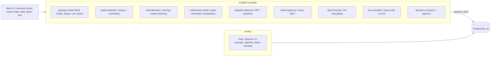

# Mining Operations Digital Twin & Ore-Grade Optimization

For an open-pit mine's short-interval control room: it estimates every block's grade with its uncertainty from drill and blast-hole
assays, learns how long each truck cycle takes, watches every engine against its own normal, re-plans haulage when the ground or the
fleet surprises it (trucks per shovel, where each shovel's ore goes, what to reclaim), schedules the crusher blend hour by hour
inside the plant's grade window, re-runs the rest of the shift in a twin to compare the new plan with the old one on the same
randomness, and dispatches it only when a second person approves.

Built from blueprint 06 of "Advanced Engineering Build Book, Volume IV" as a **vertical slice**: the demo scenario end to end,
with the platform parts real and the rest listed under [Not built](#not-built-and-why).

**The mine, its orebody, assays, haul log, engine telemetry and plant come from a simulator in this repository. No real mine data
is used. The low-grade zone and the breakdowns are injected by telling the generator, which is what lets every estimate, alarm
and plan be checked against the truth; the twin is the service's own model, and the generator then shows what really happened.**

## Run it

```bash
docker compose up --build        # migrates, seeds, serves http://localhost:8280/ui/ with one worker
docker compose run --rm test     # 12 tests against a throwaway database
```

Open http://localhost:8280/ui/ and press **Run all steps** (the recorded run took 39 seconds through the API), or `make bootstrap demo`.
Demo tokens (local only): `mine-shift_supervisor-demo`, `mine-mine_engineer-demo`, `mine-viewer-demo`. Run `make reset` before a second demo run.

## The demo, step by step

1. An invented copper mine: 28,800 blocks of 4,050 t on six benches, 780 exploration drill composites and 780 blast-hole assays,
   six shovels on their panels, 28 trucks, a crusher with a 5,000 t surge bin, a mill and two stockpiles, after a week of day and
   night shifts (13,691 truck cycles, 2.97 Mt moved, 620 kt milled, 28,224 engine windows, 13 breakdowns, all repaired before the
   demo). Trained on ten shifts and scored on the last four: kriging misplaces 9.8% of blocks across the cut-offs against 13.3%
   for inverse distance (RMSE 0.050 against 0.067 %Cu); the cycle-time model is off by 4.95% (MAPE) against 11.09% for the
   physics baseline; the engine models caught both precursor failures with 0.79 false alarms per 1,000 truck-hours against 22.19
   for the manufacturer's thresholds; the mill forecast is off by 95 t/h against 159 for the trailing mean.
2. Bench 3 as the estimator sees it, with the width of each block's 80% interval. Shovel S1 is about to start a blast whose assays
   are still at the lab; ore control calls its next blocks 0.54-0.66 %Cu, high grade. The shift starts on the mine's usual plan
   (trucks split by what each shovel needs, cut-off routing, proportional reclaim), forecast to keep the mill feed inside the
   0.48-0.68 %Cu window for 8 of 8 hours.
3. The generator is told that S1's blast hides a barren dyke (true grade × 0.3 within 45 m; the lab returns the assays at
   minute 150) and that three trucks fail: T07's tyre at 07:10, T16's cooling at 08:30, T22's oil pump at 09:20. Four hours run:
   the feed grade on the crusher's analyser falls from 0.55 to 0.32 %Cu. T16's coolant alert came 80 minutes before it failed and
   T22's oil-pressure alert 60 minutes before; neither crossed the manufacturer's threshold; the tyre gave no warning.
4. The 72 blast-hole assays come back and the block model is re-estimated (697 blocks change class): S1's next blocks drop to
   0.31-0.53 %Cu. An OEM telemetry feed is accepted for T03 and refused for an unknown truck. On the plan in force the mill feed
   is forecast inside the window for 1 hour of the remaining 8.
5. The dispatch MIP re-plans the rest of the shift for the 25 trucks still up in 37 ms (gap 0.3%): S2 and S5 gain trucks, S3
   and S6 lose them, three trucks are reassigned, waste stripping is held at the rate the old plan would manage, and the loader
   reclaims 1,500 t/h of high grade. The blend MILP schedules the loader in whole loads: mean feed grade inside the window 8 of
   8 hours (2 of 8 with the estimates' spread at z = 1.28) against 1 of 8 for a proportional blend.
6. The twin re-runs the 8 hours 20 times under each plan on the same draws: the new plan moves 4,114 t more, makes 16.3 t more
   copper (+$160k revenue), burns 682 L less fuel and keeps the feed in the window 4.2 more hours; on the full objective it is
   +$161k (10th to 90th percentile +$136k to +$193k), better in every replication. The engineer proposes it with that evidence;
   their own approval is refused (403); the shift supervisor approves.
7. Eight hours run under the approved plan. From the generator, the same shift with the baseline plan kept: the approved plan
   made 15.1 t more copper (+$147k revenue), moved 4,137 t more on 644 L less fuel and kept the feed in the window 5 hours instead
   of 1; on the full objective it came out $136k ahead, where the twin had said $161k. Then the audit trail, whose hash chain
   verifies.

## Architecture



| Piece | How it works |
|---|---|
| Simulator (`mine/world.py`) | Block grades, arsenic and hardness are smoothed Gaussian random fields (a richer porphyry core, an arsenic-bearing flank, a nugget no hole sees). Exploration holes sample them on a jittered 60 m grid; one blast hole per block with coarser error. Six shovels snake along 32 × 8-block panels the mine plan puts on core, transition and waste. Trucks follow the physics: power-limited speed on the ramp with the payload, rolling resistance, wet roads, truck age and driver; queues at each shovel and at the crusher's single dump point, which waits when the bin is full. The mill draws from a mixing bin at a rate set by the hardness; ore that is not milled goes to two stockpiles. Engines report coolant, oil pressure and exhaust every 10 minutes from their duty and the air temperature; a cooling fault heats the coolant for two hours before the engine stops, a failing oil pump loses pressure for 90 minutes, tyres fail without warning, sensors occasionally glitch. Every random draw is keyed by truck and cycle, so a shift re-runs under another plan with the same randomness. |
| Grade estimator | Gaussian-process regression (kriging) of log Cu, log As and hardness in 3D, with each sample's laboratory error as its own noise; the variogram is fitted once on the exploration holes, and new assays condition it. Posterior mean, 80% interval and probability above each cut-off per block. Baselines: inverse distance squared, nearest hole. |
| Ore control | Every block's class (HG ≥ 0.45, LG ≥ 0.25 %Cu, else waste) from the expected grade; re-issued to the plan in force whenever assays change the estimate. |
| Cycle-time and fuel models | Gradient-boosted regression of the whole cycle on the route's physics (the manufacturer's speed-on-grade curve), payload, wet road, truck age and what the dispatcher saw (queue at the shovel, trucks on the way, trucks bound for the crusher). Fuel is linear in the work done climbing and rolling and the idle minutes. |
| Engine anomaly detector | Per truck and sensor, a linear normal on duty, air temperature, payload and speed, learned from windows at least four hours before any breakdown in the maintenance log; an alert on two windows in a row more than 4 sd off in the harmful direction. A breakdown alert records how long before it the anomaly fired. Baseline: fixed thresholds. |
| Dispatch MIP | OR-Tools (SCIP). Integer trucks per shovel, counted from the shovel each truck is on; each shovel's rate bounded by a finite-source queue on the cycle-time model's travel times; a binary destination per shovel for its HG (crusher or stockpile) and LG (crusher or stockpile); reclaim; mill capacity at the estimated hardness; the grade window and arsenic limit held at estimate ± z sd; stripping held at the rate the plan in force would manage. Objective: mill value, plus stockpiled ore at 75% of its value, less fuel and rehandle. Baselines: the plan kept, a match-factor re-plan, nearest-free-shovel dispatch. |
| Blend MILP | Hour by hour: loader reclaim from each pile in 50 t loads (at least 300 t/h when a loader works a pile), how much of each pit source to feed, inside the window and under the arsenic limit with the sources' spread. Baseline: reclaim in proportion to the piles. |
| Plant forecast | Mill throughput per hour: the lesser of what the bin and the planned feed supply and the mill's rate at the hardness of the bin's blend, with one fitted scale. Baseline: trailing 12-hour mean. |
| Twin | The service's own event simulation of the rest of the shift under each plan: the cycle-time model's travel times, queues at shovels and crusher, the bin and mill, grades drawn from the estimator's posterior; every plan runs on the same draws, so differences are paired. |
| Decisions | A draft plan is proposed with its twin run; policy requires a blend schedule and a twin no worse than the plan in force; only a shift supervisor who did not propose it approves; then it is dispatched from the current minute. |
| Platform | Row-level security per tenant on every table, telemetry partitioned by month and closed to the app role except through the parent, Postgres job queue with retries and a dead-letter view, Idempotency-Key replay, hash-chained audit log, model artifacts with metrics and data snapshot, every inference and solve logged with model version and input hash, `/metrics`. |

## Data model

`migrations/002_mine.sql` follows the blueprint (mine, block, bench, haul_road, vehicle, shovel, stockpile, assay, haul_event,
plant_feed, blend_plan, simulation_run, decision_record); additions are marked `(+)`: the mine's seed, clock and what the
generator was told, site nodes, engine telemetry partitioned by month, equipment alerts, dispatch plans, model artifacts and runs.
The block model is one row per block with its estimate and spread; telemetry is 10-minute summaries, never raw engine data.

## API

| Method | Endpoint | Purpose |
|---|---|---|
| POST | `/v1/telemetry` | Engine telemetry from an OEM feed or probe; validated per record, scored against the truck's normal, alerts raised |
| GET | `/v1/orebody/tiles?bench=` | One bench as a grid: estimate, 80% interval, P(high grade), class, dug; assays; shovel faces and next blocks |
| POST | `/v1/dispatch/optimize` | 202 + job: the dispatch MIP from where the trucks are; a draft plan beside the plan in force, with gap and solve time |
| POST | `/v1/blends/solve` | 202 + job: the hourly crusher blend for a draft plan, beside the proportional blend; becomes the plan's reclaim |
| POST | `/v1/twin/simulate` | 202 + job: the rest of the shift under two or more plans on the same draws; production, fuel, revenue, objective, paired |
| GET | `/v1/plant/forecast` | Mill throughput and feed grade by hour under a plan, against the trailing mean |
| POST | `/v1/dispatch/plans/{id}/propose` · `/v1/decisions/{id}/approve` | (+) Propose with evidence; a second person approves |
| GET | `/v1/mine/overview` · `/v1/fleet` · `/v1/dispatch/plans` · `/v1/decisions` | (+) Command centre and drill-downs |
| POST | `/v1/mine:load` · `/v1/mine:advance` | (+) 202 + job: load the mine; run the shift forward, optionally telling the generator about a zone or breakdowns |

Contract: [`docs/openapi.json`](docs/openapi.json).

## Measured

[`docs/evaluation.md`](docs/evaluation.md) (`python -m mine.evaluate`, three mines the demo never uses) and
[`docs/performance.md`](docs/performance.md).

| Component | Result | Baseline |
|---|---|---|
| Grade, blocks in the wrong class at the cut-offs | 11.0-11.5% | inverse distance² 14.3-16.7%, nearest hole 18.9-21.3% |
| Grade RMSE (%Cu) | 0.049-0.052, 80% interval holding 85-89% | inverse distance² 0.069-0.080 |
| Truck cycle time, MAPE (blueprint bar: 10%) | 4.29-4.93% | physics 9.82-12.0% |
| Engine precursor failures caught | 100 of 100, median 60-64 min ahead | thresholds 64 of 100, 18-32 min |
| False engine alarms per 1,000 truck-hours | 0.58-1.72 | thresholds 25.5-31.4 |
| Mill throughput, MAE (t/h) | 119-365 | trailing mean 357-693 |
| Net value per disrupted shift (8 h after re-planning) | MIP + blend +$107k vs the plan kept, better in 5 of 6 | match-factor re-plan +$57k (3 of 6); nearest free shovel −$28k |
| … against the re-plan heuristic directly | +$50k a shift, better in 3 of 6 | |
| Blend assay deviation, mean \|feed − 0.58\| (tolerance 0.10) | 0.067 | proportional reclaim 0.101; plan kept 0.094 |
| Dispatch solve, 20 shovels and 200 trucks (bar: 10 s) | 0.09 s, gap 0.26% (per-truck formulation 0.33 s) | |

Three things these numbers say plainly. The optimiser's edge over a sensible heuristic is small and uneven: against a re-plan
that rebalances trucks by match factor it wins by $50k a shift on average but in only 3 of 6 disrupted shifts. The demo's shift
(+$136k) is one of the better ones, and it is fragile: with the solver stopped at a 0.1% gap instead of 0.5%, an equally
"optimal" plan for the same shift played out at −$31k, so the model's objective is far less precise than the solver's gap.
Most of the measurable gain is the blend: the same truck plan with proportional reclaim gives back about a quarter of the value
and two and a half hours a shift in the grade window, while the robust blend's confidence margin bought little over a mean-only
blend (0.067 against 0.073 deviation, the same net value within $2k). And the twin is useful but optimistic: its paired estimate
was within $60k of what the generator did on seven of nine shifts, and it called one shift +$60k that came out −$62k.

## The hardest tradeoff

What the dispatch plan is allowed to give up. The first version, with no rule about waste, showed a much larger gain, and it
came from moving far less waste: stripping deferred is ore not uncovered next month, and a shift-level objective cannot see it.
Stripping is now held at the rate the plan in force would manage, and the gain fell to what is reported above. The same question sits
in the stockpile valuation: a tonne stockpiled is counted at 75% of milling it now, and a plan that draws the stockpiles down looks
better or worse depending on that one number (the evaluation shows the result at 90% too). Both are mine-planning policies the
optimiser has to be given, not discover; getting them wrong makes it confidently wrong.

## Threat model (summary)

| Threat | Mitigation here | Gap |
|---|---|---|
| Forged or malformed telemetry | Every record validated on its own (known truck, aligned window, not ahead of the clock or a day old, sensors in range, required fields, no duplicate per source); refusals returned and audited | No signing of OEM feeds beyond the API token |
| A dispatch change nobody agreed | Optimiser output is a draft; proposal needs a blend schedule and twin evidence; only a supervisor who did not propose it approves; hash-chained audit | One approver; no bounded automation |
| One operator seeing another's mine | Row-level security on every table, telemetry partitions closed to the app role, tested through the API and in the database | |
| A model nobody can trace | Every inference and solve logs model version and an input hash; artifacts carry their data snapshot and metrics | No promotion workflow beyond `approved` |

## Not built, and why

- **Real-time per-truck dispatching inside the shift** (each truck reassigned at every dump against target rates): built and
  measured as an ablation, and it did worse than holding the MIP's assignment (+$76k against +$107k a shift); the plan is
  executed as an assignment.
- **A conditional-simulation geostatistics stack** (sequential Gaussian simulation, multiple domains): one domain and kriging with
  its posterior spread were enough to beat the baselines here; the twin samples block grades independently, which understates
  correlated grade risk.
- **Equipment-health prognostics beyond the precursor detector**: tyre and electrical failures have no precursor in this world and
  nothing predicts them.
- **PostGIS, CesiumJS, TimescaleDB, ClickHouse, Kafka, PyTorch, Gurobi, Kubernetes, Terraform, OpenTelemetry/Grafana, a React
  front end, OIDC/SSO, SSE progress**: not needed to prove the slice (jobs are polled; the bench map is SVG). No cloud account used.
- **More than one shift after the history**: the slice runs the demo shift; `make reset` replays it.

## Commercial sketch

Buyers: mining companies, operators and engineering consultancies. Pricing shape from the blueprint: per site, by fleet size, with
an optimisation compute tier. The ROI line is the evaluation's, and it should be sold as measured: a modest, uneven gain from
dispatch, a steadier one from blending to the plant's window, and engine alerts an hour ahead of failure with a tenth of the
nuisance alarms.

## Layout

```
core/        platform kit: db + RLS, jobs, audit chain, HTTP, scenario runner, load test
mine/        world (the mine), engine (kriging, models, MIP, blend, twin), api, seed, evaluate
migrations/  forward-only SQL          web/   UI, scenario.json, demo.json (recorded run)
tests/       12 tests                  docs/  evaluation.md, performance.md, openapi.json
```
