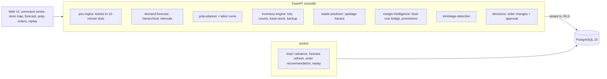

# Autonomous Restaurant Chain Operations Intelligence

For a multi-location restaurant group's operations team: it forecasts every store's demand item by item in 15-minute slots
with intervals that hold their level, turns the forecast into prep plans for the kitchen and orders for the suppliers, ranks the
lots in the walk-in by how likely they are to be thrown away, re-plans when a supplier's truck will be late or a storm is coming,
sends the bigger order changes to a store manager, replays the same days under the old plans to count the waste and lost sales
the re-plan saved, and explains food cost from recipe to actual, including the stores whose usage runs ahead of their sales.

Built from blueprint 10 of "Advanced Engineering Build Book, Volume IV" as a **vertical slice**: the demo scenario end to end,
with the platform parts real and the rest listed under [Not built](#not-built-and-why).

**The chain, its customers, kitchens, suppliers, weather and walk-ins come from a simulator in this repository. No real
restaurant data is used. The late truck and the rainstorm are injected by telling the generator, which is what lets every
forecast, plan and alarm be checked against the truth; the replay re-runs the same generator, so its waste and lost sales are as
right as the simulator, which here is the truth.**

## Run it

```bash
docker compose up --build        # migrates, seeds, serves http://localhost:8320/ui/ with one worker
docker compose run --rm test     # 13 tests against a throwaway database
```

Open http://localhost:8320/ui/ and press **Run all steps** (the recorded run took 33 seconds through the API), or `make bootstrap demo`.
Demo tokens (local only): `resto-store_manager-demo`, `resto-planner-demo`, `resto-viewer-demo`. Run `make reset` before a second demo run.

## The demo, step by step

1. An invented fast-casual chain, Verde Grill: 50 stores in five regions (downtown, suburban and campus formats), a 12-item menu
   built from 15 ingredients and 6 prepped components, three suppliers with lead times and delivery days. Eight weeks of history
   ran the chain's usual way (par prep from the last two same weekdays, par orders): 2,372,934 units sold, 3,225,600
   fifteen-minute counts, 20,375 lots received, and 12.5% of $6.37M of purchases thrown away. Trained on six weeks and scored
   on the last two: the 15-minute lunch forecast's WAPE is 0.493 against 0.688 for the same slot last week; the 90% interval
   holds 91.4% of item lunch rushes; rain is learned at -51% for dine-in and +58% for delivery per unit of intensity (the
   generator's -50% and +60%); the spoilage hazard's AUC is 0.865 against 0.808 for age alone and 0.614 for the printed date.
2. Sunday night. The forecast is refreshed for every store, item and 15-minute slot of Monday and Tuesday in 643 ms: Monday's
   lunch rush 22,478 items chain-wide (90%: 21,941-23,020; last Monday sold 22,205); Uptown 1 (S11) 377 (318-439), 26% of it
   delivery. The levels add up: chain = stores = items = slots.
3. Prep plans for all 50 stores (450 tasks, 707 hours of prep labor, $67.3k of food against $64.5k at the usual par), each to the
   90th percentile of its window's demand, with the cooks each lunch slot needs. Tonight's orders: 599 lines, all within $250 of
   par and approved automatically. Waste risk on 446 open lots: $12.3k expected to be thrown away in two days; 37 lots above 15%
   risk, where the printed date alone flags the 50 lots on their last day.
4. The generator is told that the produce truck for Harbor and Uptown will be a day late on Monday and that heavy rain will sit
   over Uptown and Midtown from 11:00 to 15:00. The service receives the supplier's notice and the weather service's forecast.
   A catering pre-order arrives through the POS API: 24 items accepted; a ticket for an item not on the menu and a replayed
   ticket refused.
5. Re-plan. Monday's lunch rush falls to 20,302 (S11: 299, 49% of it delivery); the prep plan drops $2,967 of food. Tonight's
   orders are re-run with the late truck in the pipeline: backup orders from the cash-and-carry for 20 stores ($11.2k at a 35%
   premium); 4 lines ($1,305) move more than $250 from par. The planner cannot approve them (403); the store manager does.
6. Monday to Wednesday run on the approved plan: 1.9% of demand lost to stockouts (2,632 of 139,042 units), $37.4k thrown away,
   a $3,015 backup premium. Replayed from the same stock with the same customers, weather and spoilage (as run: identical): the
   plan made before the notices loses 9.5% and throws away $48.6k; the chain's usual practice loses 13.0% and throws away $56.6k.
   On Monday alone: 2.2% against 25.8% and 27.1%.
7. Food cost for the last seven days: 23.59% of revenue at recipe, 27.27% actual, of which 2.63 points are prep waste. The taco
   promotion sold 6,237 tacos, 1,788 more than without it at its estimated elasticity of 1.51, gave away $12,474 and earned
   $934 more margin. Shrinkage: S01 and S15 flagged as over-portioning and S07 and S09 as theft or unrecorded loss, which is
   exactly what the generator injected; a fixed 4% variance threshold flags all 50 stores. Then the audit trail, whose hash
   chain verifies.

## Architecture



| Piece | How it works |
|---|---|
| Simulator (`resto/world.py`) | Demand per store, item, channel and 15-minute slot: the store's volume and format (downtown stores live on weekday lunches, suburban ones on dinners and weekends), its hour shape and item mix, rain (dine-in -50%, delivery +60% per unit intensity), local events (+60% in the evening), promotions with a true elasticity per item, a store-day shock and gamma-Poisson slot noise. The kitchen preps components before each window and throws away what is left at the end of the hold; when a component runs low it cooks a top-up that takes 30 minutes; an item whose component or ingredient is out is 86'd and that demand is lost and never appears in the sales. Lots arrive from three suppliers with lead times and delivery days, are used oldest first, spoil with a hazard rising with age and walk-in temperature, and are thrown away at their date. Avocados yield less than the recipe says everywhere; four stores lose stock to theft or a heavy hand. Every random draw is keyed by day and purpose, so the same days re-run under another plan meet the same customers. |
| Demand forecast | Store x channel x weekday level, store x channel x day-type hour shape shrunk toward the format's, store x channel item mix shrunk toward the chain's, rain by channel, events, and an elasticity per item shrunk toward the pooled one; fitted as a Poisson model by alternating updates, on the slots where the item was not 86'd. A shared store-day shock and slot overdispersion give negative-binomial intervals at every level, so the chain's interval is not the sum of the stores'. Baseline: the same slot last week with empirical error quantiles. |
| Consumption | Recipes (bill of materials to components and ingredients at spec yields) x a learned ratio of counted to theoretical usage per store and ingredient. Baseline: recipes alone; last week's usage. |
| Prep planner | Each component to the 90th percentile of its window's demand (hot-held: lunch and dinner; cold: the day); dinner re-planned at 15:00 from what lunch sold; labor minutes and cooks per lunch slot. Baseline: par from the last two same weekdays + 15%, more after a run-out. |
| Inventory engine | Base-stock to the 95th percentile of each delivery's cover, net of the stock the hazard model expects to survive to arrival and what is due (suppliers' notices applied), capped by shelf life; a backup order when stock and what will really arrive leave a store short. Lines more than $250 from par go to a store manager; unattended, they go at par. Baseline: par ordering from last two weeks' usage + 15%. |
| Spoilage hazard | Discrete-time hazard (logistic regression on lot-days: age over shelf life, walk-in temperature, ingredient). Baseline: the printed date; age alone. |
| Shrinkage | Counted against theoretical usage per store and ingredient, judged against the chain's median for that ingredient in standard errors of the chain's daily scatter; classed by how many portioned ingredients move together. Baseline: variance above 4%. |
| Replay | The days just run, re-run in the generator from the same starting stock under other plans; waste, lost sales and spend from the generator's truth. |
| Platform | Row-level security per tenant on every table, Postgres job queue with retries and a dead-letter view, Idempotency-Key replay, hash-chained audit log, model artifacts with metrics and data snapshot, every forecast, plan and risk read logged with model version and input hash, `/metrics`. |

## Data model

`migrations/002_resto.sql` follows the blueprint (location, menu_item, ingredient, recipe, sale, inventory_lot, supplier_order,
prep_task, waste_event, forecast, promotion, decision_record); additions are marked `(+)`: the chain's seed, clock and what the
generator was told, prepped components, conditions (rain observed and forecast, events, walk-in temperature), closing counts,
prep plans, recommendations, forecast runs, notices, alerts, model artifacts and runs, replay outcomes. Sales are one row per
store, item and day with the 48 slots as bounded arrays per channel and the slots the item was 86'd, never a row per ticket.

## API

| Method | Endpoint | Purpose |
|---|---|---|
| POST | `/v1/sales/ingest` | POS tickets for the day in progress, validated one by one (store, items, opening hours, date, replay) and added to the slots |
| GET | `/v1/forecast` | A day's forecast: the chain's 15-minute curve, every store's lunch rush, one store item by item, all with 90% intervals |
| POST | `/v1/prep/plan` | Prep plans for every store for tomorrow, with the usual par beside them, labor and the crew curve; supersedes the last |
| POST | `/v1/orders/recommend` | 202 + job: tonight's orders with their evidence; lines beyond the limit become a proposal |
| GET | `/v1/waste/risk` | Every open lot's chance of being thrown away in two days and its expected loss, beside the printed date |
| GET | `/v1/margins/explain` | Food cost from recipe to actual by cause, store and ingredient; promotions' incremental margin |
| POST | `/v1/forecast:refresh` | (+) 202 + job: refresh every store, item and slot for the next days, timed |
| POST | `/v1/decisions/{id}/approve` · GET `/v1/decisions` | (+) A store manager approves order changes; the proposer cannot |
| GET | `/v1/shrinkage` · `/v1/chain/overview` | (+) Shrinkage cases with evidence; the command centre |
| POST | `/v1/chain:load` · `/v1/chain:advance` · `/v1/outcomes:compare` | (+) 202 + job: load the chain; run days (optionally telling the generator first); replay them under other plans |

Contract: [`docs/openapi.json`](docs/openapi.json).

## Measured

[`docs/evaluation.md`](docs/evaluation.md) (`python -m resto.evaluate`, three chains the demo never uses; shrinkage on six) and
[`docs/performance.md`](docs/performance.md).

| Component | Result | Baseline |
|---|---|---|
| Lunch forecast, item x store x 15 min, WAPE | 0.485-0.508 | same slot last week 0.670-0.700 |
| ... 90% interval: randomised PIT inside it / literal coverage | 89.7-89.9% / 95.9-96.0% | 93.5-94.1% literal |
| Item x store lunch rush, 90% coverage (blueprint band 85-95%) | 91.0-91.2%, width 20-22 units | 91.7-92.7%, width 32-36 |
| ... WAPE | 0.162-0.171 | 0.245-0.248 |
| Store x day, 90% coverage | 86.0-87.9% (WAPE 0.074-0.078) | 85.6-87.3% (0.109-0.120) |
| Promotion elasticity, error on promoted items | 0.05-0.12 | one pooled elasticity 0.44-0.57 |
| Ingredient usage over two weeks, WAPE | 0.65-0.72% | recipes alone 1.81-1.89%; last week 2.21-3.09% |
| Spoilage hazard AUC, another chain | 0.844-0.846 | age alone 0.802-0.809; printed date 0.605-0.624 |
| Shrinkage stores found (24 injected in 300) | 24, none falsely (class right for 24) | 4% threshold: 24, and all 276 others |
| 14 days of planning: waste, share of purchases | 9.0% unattended; 8.8% every line approved | usual practice 12.1% |
| ... stockout rate (demand lost) | 1.93% unattended; 1.80% approved | 3.10% |
| The demo's disruption, three days: stockout rate | 1.4-1.8% re-planned | 8.7-10.3% plan before the notices; 9.8-12.1% usual |
| ... waste | $28.7-33.2k | $36.7-42.2k; $47.1-51.3k |
| Forecast refresh, 50 stores, through the API (blueprint: p95 < 2 min) | p95 1.22 s from request to result; 711 ms in the job | |

Three things these numbers say plainly. Most of the planning gain is prep, not ordering: of $156k of waste avoided in 14 days
on three chains, $135k is food prepped and thrown away, because the usual par carries two weeks of noise and none of the
weather, events or promotions. The spoilage hazard model ranks lots better than age or the printed date, but it does not earn its
place in ordering: with printed dates instead the planner wasted $401,862 against $402,804 and ran out on 1.82% of demand against
1.80%, because lots here turn over in two or three days; its use is the waste-risk list. And the disruption is won by one
decision: without the backup order for the stores whose produce truck is late, the plan made before the notices does barely
better than usual practice on the first day (25-29% of demand lost on three chains, 25.8% in the demo).

## The hardest tradeoff

What counts as demand. The POS records sales, and a store that ran out sold less than its customers wanted; the chain's usual
par sheets are built on those sales, which is how a store that runs out on a Wednesday orders less for the next Wednesday. The
forecast here is fitted only on slots where the item was available, and is scored on the generator's true demand, which no real
chain has. The cost is that the 86'd flags must be trusted: a kitchen that stops selling an item without marking it hides demand
from the model as surely as from the par sheet, and dropping the slot where an item ran out drops a slot that was busier than
usual, which leans the fit slightly low. The alternative, fitting on sales, plans the next stockout.

## Threat model (summary)

| Threat | Mitigation here | Gap |
|---|---|---|
| A forged or replayed POS batch | Every ticket validated on its own (known store and items, today's date, opening hours, quantity bounds); ticket ids kept per store, so a replay is refused; Idempotency-Key on the batch; every ingest audited | No signing of POS messages beyond the API token |
| An order nobody agreed to | Lines beyond $250 of par are proposals; only a store manager who did not ask for them approves; unattended, the planner places par instead; all in the hash-chained audit log | The approver is scoped to the tenant, not to their own stores; one approver |
| One group seeing another's sales and margins | Row-level security on every table, tested through the API and in the database | |
| A model nobody can trace | Every forecast, plan and risk read logs model version and an input hash; artifacts carry their data snapshot and metrics | No promotion workflow beyond `approved` |

## Not built, and why

- **LightGBM or PyTorch forecasters**: the multiplicative Poisson model with shrinkage reaches the noise floor at 15 minutes
  (WAPE about 0.5 on three units a slot is mostly Poisson) and its intervals hold their level; a tree model would need its
  intervals bolted on.
- **A labor scheduler**: the prep plan hands over labor minutes and cooks per lunch slot (the labor-interface's output); shift
  building, availability and labor law are a product of their own.
- **Transfers between stores, markdowns, and a MILP over orders**: base-stock per store and ingredient with a backup supplier
  was enough to show the waste and stockout trade; transfers would turn the waste-risk list's "move to a sister store" into an
  action.
- **Real POS, supplier and weather connectors**: the generator stands in for all three; the ingest API shows the POS contract.
- **Kafka, ClickHouse, Redis, object storage, Kubernetes, Terraform, OpenTelemetry/Grafana, a Next.js front end, OIDC/SSO, SSE
  progress**: not needed to prove the slice (jobs are polled; the store map is SVG). No cloud account used.

## Commercial sketch

Buyers: multi-location restaurant groups, franchise operators and ghost kitchens. Pricing shape from the blueprint: per location
per month, with an advanced optimisation module. The ROI line is the evaluation's: about three points of purchases less waste
and a third fewer lost sales on ordinary days, and on a day a truck is late, most of a day's menu kept on sale for a backup
premium of a few thousand dollars across 50 stores.

## Layout

```
core/        platform kit: db + RLS, jobs, audit chain, HTTP, scenario runner, load test
resto/       world (the chain), engine (forecast, consumption, hazard, shrinkage, planners), api, seed, evaluate
migrations/  forward-only SQL          web/   UI, scenario.json, demo.json (recorded run)
tests/       13 tests                  docs/  evaluation.md, performance.md, openapi.json
```
