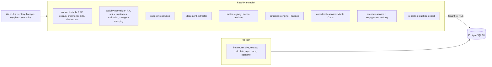

# Global Carbon Accounting & Scope-3 Supply Network Intelligence

For a multinational's carbon team: it pulls every subsidiary's vendor master and AP ledger, the forwarders' shipment records,
the utility bills and the suppliers' sustainability disclosures; resolves the same supplier hiding under different names in
six ERPs; maps two million invoice lines to spend categories; calculates Scope 1, 2 and 3 with a frozen factor version so the
inventory reproduces bit for bit, keeps a lineage row from every CO2e figure back to its invoice and factor, puts Monte Carlo
bands on it, ranks which suppliers to engage, and recalculates scenarios (air freight to ocean, suppliers decarbonising) from
every stored line. Changing the factors and publishing the inventory each need a second person.

Built from blueprint 03 of "Advanced Engineering Build Book, Volume IV" as a **vertical slice**: the demo scenario end to end,
with the platform parts real and the rest listed under [Not built](#not-built-and-why).

**The company, its suppliers, invoices, shipments, bills and disclosures come from a simulator in this repository, and so does
the emission-factor catalogue: its values are illustrative, not an official dataset. No real company's data is used. Accuracy
figures are measured against the generator's truth, which the service never reads; on real data the classifier in particular
would score lower (see Measured).**

## Run it

```bash
docker compose up --build        # migrates, seeds, serves http://localhost:8250/ui/ with one worker
docker compose run --rm test     # 15 tests against a throwaway database (about 45 s)
```

Open http://localhost:8250/ui/ and press **Run all steps** (about four and a half minutes: it imports two million invoice
lines), or `make bootstrap demo`. Demo tokens (local only): `meridale-lead-demo`, `meridale-analyst-demo`,
`meridale-viewer-demo`. Run `make reset` before a second demo run.

## The demo, step by step

1. An invented industrial group, Meridale, with six subsidiaries on six ERPs in six currencies and 18 facilities. The factor
   registry holds two frozen versions of an illustrative catalogue (76 factors each). The category classifier, trained on last
   year's analyst-labelled lines, maps 97.2% of held-back spend to the right category against 89.4% for keyword and account
   rules; the supplier matcher, trained on two earlier engagements, scores pairwise F1 0.971 on a third against 0.898 for fuzzy
   name similarity and 0.333 for exact names.
2. The connector pulls 914 vendor records and 2,008,046 invoice lines ($2.38bn), 40,000 shipments, 577 bills and 34
   disclosures in 108 s. It drops 8,046 double postings (exactly the number the generator injected), refuses 1,238 lines with
   the reason (unknown vendor, unknown currency, outside the year), maps 345 currency spellings and makes 18,689 unit
   conversions. 0.62% of lines (0.57% of spend) end as orphans after mapping, against 1.91% for the rules alone; 16,321 review
   tasks hold the lines the classifier abstained on. Three lines keyed from paper invoices: two accepted, one refused for
   currency "GPB".
3. Resolution turns 914 vendor records into 468 suppliers (the generator has 460), scoring 7,079 candidate pairs of 417,241,
   refusing 18 merges that would join two tax ids and sending 52 pairs to review. Against the truth: F1 0.979, fuzzy name
   alone 0.905, exact name 0.288. The largest supplier, $108.0m of spend, sat in six vendor masters under six spellings.
4. 34 disclosures read: all 132 figures within 1% of what was written; 29 accepted, 5 held (four omit upstream emissions, one
   has revenue in thousands labelled millions, refused as implausible). The 29 become supplier-specific factors in a draft
   version EF-2025.1-S1; the analyst's own approval is refused and the lead approves, which freezes it.
5. 2,039,340 activity lines calculated with EF-2025.1-S1 in 75 s: Scope 1 16.0 kt, Scope 2 60.2 kt, Scope 3 1,244.8 kt
   (95% interval 1,122-1,400), total 1,321.0 kt (1,198-1,474). Lineage coverage 100% (1,699,899 of 1,699,899 lines carrying
   CO2e), orphans 0.62%. Recalculated from the stored activities and from the stored lineage rows: identical hashes. Against
   the plain catalogue the disclosures move the total from 1,357.9 kt to 1,321.0 kt, on 310,917 lines.
6. One figure traced: invoice line `MDG-BR:BR2511-2243643:3`, "Steel tube 408x25", 153,029.79 BRL x 0.182894 = $27,988.23,
   steel (confidence 0.960, the model call logged), vendor record resolved with two others to Ridgeway Steel Trading Ltd. (IN),
   factor SPEND:steel_metals:IN 1.785 kgCO2e/$ in the frozen version: 49,959 kgCO2e, re-derived exactly. Then the engagement
   ranking: 9 of its top 20 are also in the top 20 by spend; against the generator's truth the top 20 reach 50.5% of supplier
   emissions, against 38.7% when ranked by spend.
7. Scenario from every stored line: all non-urgent intercontinental air moved to ocean (2,520 t, +28.6 days in transit:
   -15.4 kt) and the top 20 suppliers cutting intensity 30% (-170.7 kt in category 1): -191.1 kt in total, 95% interval
   -233 to -161 kt, recalculated in 13.9 s. The inventory passes the policy checks, is proposed, approved by the lead and
   exported with its SHA-256; the audit chain verifies.

## Architecture



| Piece | How it works |
|---|---|
| Simulator (`carbon/world.py`) | 460 suppliers per company, each with a true spend category (some sell two), a country, a tax id, a company domain and a true carbon intensity: the catalogue's sector average times a per-company error on that average, times the supplier's own offset. Each subsidiary's clerk keys them differently (case, legal forms, abbreviations, typos, notes, word order, one ERP truncating at 24 characters); 10% of suppliers have a near-namesake that is a different company. Invoice lines come from templates in four languages, a fifth shared between categories or uninformative, posted to a coarse chart of accounts with 10% miscoded; double postings, odd currency spellings, unknown vendors and wrong years are injected and counted. Component makers buy from the mills (the tier-2 network); disclosures render the truth in three layouts with scale words and kt/Mt units. Every draw is keyed by seed and month, so two million lines stream month by month. |
| Normaliser | Currencies at the month's rate (aliases mapped, anything else refused), pounds, miles, therms, m3, MWh and US gallons converted, a line unique per (subsidiary, invoice, line) in memory and in the database, so a repeated import lands once. |
| Category mapping | Character n-gram TF-IDF on GL account, normalised vendor name and description (digits masked) into logistic regression, trained on 6,000 labelled lines; each distinct input classified once (105,620 for two million lines) and logged with model version and hash. Below 0.55 it abstains to keyword rules, then the account, and a review task; neither answering makes an orphan. Baseline: those rules alone. |
| Supplier resolution | Blocking: each record's 12 nearest character n-gram neighbours plus every pair sharing a tax id or company domain. Logistic matcher on TF-IDF cosine (the embedding-style match), token Jaccard, sequence ratio, tax id (+1 equal, -1 different), domain, country and subsidiary; merges in order of probability, never joining two tax ids; 0.3-0.7 goes to review. Baselines: exact name after case and punctuation; fuzzy similarity alone. |
| Disclosures | A parser that reads revenue with its currency and scale word and each scope with its unit; validation requires scope 1, 2 and 3 upstream (a cradle-to-gate intensity) and an intensity between 0.03 and 5 kgCO2e/$; the company and its named principal suppliers matched to resolved suppliers. |
| Factor registry | Versions are drafts until approved, then frozen by database triggers: no factor added, edited or deleted, no unfreezing. Supplier-specific factors apply to the supplier's main category with us. |
| Emissions engine | Spend x sector factor by category and the supplier's region (or its own factor); shipments by tonne-km and mode; bills by grid or fuel factor; freight and energy invoices are left to the shipments and bills so nothing is counted twice. Run on the few thousand distinct combinations of kind, category, country, supplier, mode and fuel, then multiplied out over every line; a lineage row per line; a SHA-256 over every line's id, factor and CO2e. |
| Uncertainty | 2,000 draws: one lognormal multiplier per factor (its GSD) shared by every line that uses it, one per supplier around the sector mean for spend-based lines. Scenarios use the same draws before and after, so the change has its own interval. |
| Engagement | Emission-weighted Katz centrality on the supplier network the disclosures reveal: a supplier's estimated emissions plus a default 45% embodied share of each disclosing customer's footprint, split 60/40 over the suppliers it names. Baseline: rank by spend. |
| Decisions | Adopting a factor version and publishing an inventory are proposals; a lead who did not propose approves. Publication first passes policy checks: 100% lineage, orphans under 1%, a reproduction that matched. |
| Platform | Row-level security per tenant on every table, Postgres job queue with retries and a dead-letter view, Idempotency-Key replay, hash-chained audit log, model artifacts with metrics and data snapshot, every inference logged with model version and input hash, `/metrics`. |

## Data model

`migrations/002_carbon.sql` follows the blueprint (organization, facility, supplier, supplier_alias, activity,
emission_factor, factor_version, calculation, calculation_lineage, scenario, assurance_evidence, decision_record) with
model_artifacts and model_runs; additions are marked `(+)`: import batches, the review inbox, the group's seed and what the
generator was told, the current factor version, a supplier's spread around its sector mean. Shipments and bills are activity
rows of their own kind; disclosures, reproduction checks and exports are assurance evidence with their hashes.

## API

| Method | Endpoint | Purpose |
|---|---|---|
| POST | `/v1/activities/import` | `connector`: 202 + job pulling vendor masters, AP ledgers, shipments, bills, disclosures; `rows`: up to 500 lines keyed in, validated one by one |
| POST | `/v1/suppliers/resolve` | 202 + job: vendor records into suppliers, with evidence and review tasks |
| GET | `/v1/calculations/{id}/lineage` | One figure traced to its invoice, mapping, supplier and factor (`activity_id`), or coverage |
| POST | `/v1/scenarios` | 202 + job: freight shifted between modes and suppliers decarbonising, recalculated from every line, paired intervals |
| GET | `/v1/inventory/scope3` | Scope 3 by GHG and spend category with 95% intervals, methods, suppliers, orphans, coverage |
| POST | `/v1/reports/export` | The published inventory as a report and CSV, hashed and kept as evidence |
| POST | `/v1/company:load` · `GET /v1/overview` | (+) Load the synthetic company and models; the command centre |
| POST | `/v1/documents/extract` · `/v1/factor-versions` | (+) Read disclosures; propose a version with supplier-specific factors |
| POST | `/v1/calculations` · `/v1/calculations/{id}:reproduce` · `/v1/calculations/{id}/publish` | (+) Calculate; reproduce and compare hashes; propose publication |
| POST | `/v1/decisions/{id}/approve` · GET `/v1/review-tasks` · `/v1/suppliers/engagement` · `/v1/suppliers/{id}` | (+) Second person; inbox; who to engage; a supplier's records |

Contract: [`docs/openapi.json`](docs/openapi.json).

## Measured

[`docs/evaluation.md`](docs/evaluation.md) (`python -m carbon.evaluate`, three companies the demo never uses) and
[`docs/performance.md`](docs/performance.md).

| Component | Result | Baseline |
|---|---|---|
| Supplier resolution, pairwise F1 | 0.976-0.980 | fuzzy name 0.887-0.923; exact name 0.245-0.340 |
| Spend mapped to the right category | 98.0-98.8% | keyword and account rules 91.1-91.4% |
| Orphan lines after mapping (blueprint: under 1%) | 0.49-0.63% | rules 1.92-1.94% |
| Disclosure figures read within 1% | 409 of 409 | first number, assumed units: 167 of 409 |
| Inventory buckets inside the 95% interval | 50 of 54 with disclosures | 47 of 54 with the catalogue alone |
| Mean error, spend categories | 13.8% with disclosures | 17.0% catalogue alone |
| True supplier emissions within reach of the top 20 | 44.0-49.9% (emissions + network) | by spend 28.9-33.3%; by emissions alone 44.0-50.4% |
| Same frozen version, same inputs | identical hash, every company and the demo | |
| Lineage coverage (blueprint: 100%) | 100%, 1,699,899 of 1,699,899 lines in the demo | |
| Scenario recalculation, 10.2 million lines (blueprint: under 60 s) | 39.6-41.5 s | |

Three things these numbers say plainly. The biggest error in the inventory is the factor catalogue's, not the software's: a
sector average that is itself off moves a whole category, the catalogue-only intervals hold the truth in 87% of buckets rather
than 95%, and supplier-specific factors help only for the 17% of spend whose suppliers disclosed in full. The network
centrality adds nothing measurable to supplier prioritisation here (+0.5, -0.5 and 0.0 points over ranking by estimated
emissions); the large step is ranking by emissions instead of spend. And the classifier's 98% comes from templated
descriptions where the vendor's name and the account carry most of the signal; real AP text will score lower, and the
abstain-and-review path is what keeps that honest.

## The hardest tradeoff

A lineage row for every activity line, or lineage reconstructed on demand. Storing two million rows per calculation is the
most expensive step (43.5 of the calculation's 75 s, and the scan that dominates scenario time) and a columnar store would
hold it more cheaply. Reconstructing on demand would be fast, but then "this figure came from that invoice and that factor"
is a claim the code makes after the fact, and a change to a mapping or a supplier merge silently changes history. Stored rows
let the database check that every figure re-derives from its links (100% coverage is a query, not a promise), let the hash
over the stored rows be compared with a fresh recalculation, and let an assurer ask about one line of a published
inventory years later. The cost is paid in storage and in scan time; the scenario bar of 60 s is met at 10 million lines on
four cores, and would be crossed somewhere past 15 million on this machine.

## Threat model (summary)

| Threat | Mitigation here | Gap |
|---|---|---|
| A quietly changed factor rewrites a published inventory | Frozen versions enforced by database triggers; a version's content hash checked on every reproduction; changes only as a new version a second person approves | One approver |
| A published figure nobody can trace | A lineage row per line, coverage checked in SQL, publication blocked below 100% or without a matching reproduction | |
| A forged or malformed import | Each line validated with its reason; unknown vendors, currencies and periods refused; duplicates refused by a unique key; every import audited | No signing of connector payloads beyond the API token |
| One client's suppliers or spend seen by another (a consultancy's tenants) | Row-level security on every table, tested through the API and in the database | |
| A model nobody can trace | Every classifier, matcher and extractor call logged with model version and an input hash, never the raw text; artifacts carry their data snapshot and metrics | No drift monitor |

## Not built, and why

- **Kafka, Airflow, dbt, BigQuery or Snowflake, Neo4j, pgvector, Kubernetes, Terraform, a React front end, SSO/SCIM**:
  not needed to prove the slice. The analytical plane would take the lineage rows (see the tradeoff); a graph store is
  unnecessary for a network of 31 observed edges.
- **A learned embedding model or an LLM for entity resolution and document extraction**: character n-gram TF-IDF plus tax
  id and domain reached F1 0.98, and the parser read every figure; neither has the headroom to show a bigger model's value on
  this data.
- **Classification uncertainty in the Monte Carlo**: the bands carry factor and supplier uncertainty, not the chance a line
  was mapped to the wrong category (1-2% of spend here).
- **Market-based Scope 2, Scope 3 categories 3, 5, 7 and 8-15, product-level (PCF) factors, model drift monitors, SSE
  progress streams**: outside the demo scenario; listed in the export as not included.

## Commercial sketch

Buyer: global manufacturers' sustainability and procurement teams, and the consultancies that do their inventories. Pricing
shape from the blueprint: subscription by subsidiaries, transactions and suppliers, with the assurance module (lineage,
reproduction, evidence export) as the premium tier. The value line is the audit: an inventory an assurer can trace line by
line, and a supplier programme aimed at emissions rather than spend.

## Layout

```
core/        platform kit: db + RLS, jobs, audit chain, HTTP, scenario runner, load test
carbon/      world (the company), engine (normalising, matching, mapping, extraction, emissions, Monte Carlo,
             network, scenarios), api, seed, evaluate
migrations/  forward-only SQL          web/     UI, scenario.json, demo.json (recorded run)
tests/       15 tests                  docs/    evaluation.md, performance.md, openapi.json
scripts/     bench_scenario.py (the 10-million-line scenario benchmark)
```
