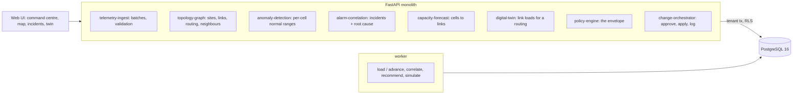

# Telecom Network Self-Healing & Capacity Optimization

For a mobile operator's network operations centre: it takes the counters and alarms of a metro radio network every 15 minutes,
scores every cell against its own normal, turns alarm storms into incidents with a ranked root cause and the evidence for it,
forecasts traffic onto every backhaul link, searches for a reroute that stays inside a declared policy envelope with a digital
twin, and applies it only when a second person approves.

Built from blueprint 04 of "Advanced Engineering Build Book, Volume IV" as a **vertical slice**: the demo scenario end to end,
with the platform parts real and the rest listed under [Not built](#not-built-and-why).

**The network, its traffic, counters and alarms come from a simulator in this repository. No operator data is used. Faults are
injected by telling the generator, which is what lets every incident and ranking be checked against the truth; the digital twin
is the service's own model (forecast traffic over measured capacity), and the generator then shows what really happened.**

## Run it

```bash
docker compose up --build        # migrates, seeds, serves http://localhost:8260/ui/ with one worker
docker compose run --rm test     # 13 tests against a throwaway database
```

Open http://localhost:8260/ui/ and press **Run all steps** (the recorded run took 17 seconds through the API), or `make bootstrap demo`.
Demo tokens (local only): `metro-noc_manager-demo`, `metro-noc_engineer-demo`, `metro-viewer-demo`. Run `make reset` before a second demo run.

## The demo, step by step

1. An invented metro: a core router, four aggregation routers, 44 sites (12 hubs on fibre or microwave, tail sites on microwave
   behind them), 264 cells and 74 links, with four weeks of counters (6.8 million values), 3,790 vendor alarms and 101
   configuration changes; 37 faults happened in those weeks and all were fixed before today. Trained on three weeks and scored on
   the fourth: the anomaly detector's F1 is 0.961 against 0.949 for the vendor's static thresholds; the 24-hour traffic forecast is
   off by 8.0% (WAPE) against 10.6% for seasonal naive. The history's fault alarms correlate 42.8:1 (2,269 alarms into 53
   incidents; 3.3:1 over all alarms), and the closed tickets' root cause is in the top three for 32 of 32 against 21 of 32 for
   the most-alarmed element.
2. The topology on a map, links coloured by load, and cell S10-B-L over three days against its seasonal normal with tomorrow's forecast.
3. At 14:30 on a Monday the generator halves the capacity of the microwave backhaul from hub S08 (L-S08-AGG-NE) and makes it drop
   0.55% of packets; at 15:00 a change pushes a wrong neighbour table to cell S10-B-L. Three hours run: 403 alarms, up to 65 in
   15 minutes; 25 cells anomalous; the service raises 14 KPI_ANOMALY alarms of its own. Each interval is stored, scored and
   correlated in 21.8 ms (p95).
4. Correlation: 403 alarms become 11 incidents (36.6:1; de-duplication leaves 61 groups). 360 alarms on 25 elements are one
   transport incident rooted at L-S08-AGG-NE (confidence 0.86: it explains 41 of 41 alarmed elements, all 24 of its cells alarm, it
   has 29 alarms of its own and its telemetry is anomalous; the router at its near end explains the same but has none). Here the
   most-alarmed element is the link too. The handover failures are a second incident (31 alarms on 6 elements) rooted at S10-B-L
   with its configuration change at 15:00 (confidence 0.87); the most-alarmed elements are S09-C-L, S07-A-L and S10-C-L, not it.
   A probe reports into the same interval: two samples accepted (one anomalous at distance 103 against 25.7), two refused (an
   unknown cell; a PRB utilisation of 1.7), and its alarm joins the open incident.
5. The forecast on today's routing: L-S08-AGG-NE, now at 1,500 of 3,000 Mbps, peaks at 113% at 20:00. Seven reroute plans go
   through the digital twin; one is inside the envelope: move tail sites S10 and S11 to their standby links to hub S05 (the link
   peaks at 60%, nothing it touches above 63%; intervals over the limit 27 → 0). S10 alone leaves 79%, over the 75% limit (80% less
   a 5-point forecast margin); anything that moves S09 moves a hospital. Rerouting everything possible is simulated and breaks the
   envelope. For the handover incident: roll back the change (handover success on the cell and its 8 neighbours 98.6% the day
   before, 86.4% now).
6. The engineer's proposal of the naive reroute is refused (422 `outside_policy_envelope`); the recommended plan (two reroutes and
   the rollback) is proposed and re-checked on a fresh forecast; the engineer cannot approve it (403); the NOC manager does, the
   policy engine checks it again, and the change orchestrator applies it from 17:00 and logs three configuration changes.
7. Six hours through the busy hour: the link, at 92% and climbing before the plan, peaks at 61% (the twin said 60%); handover
   success on S10-B-L returns from 68% to 98%. 586 alarms in six hours, nearly all packet loss on the cells still behind the
   degraded link: its incident stays open for a field visit. The audit chain verifies.

## Architecture



| Piece | How it works |
|---|---|
| Simulator (`noc/world.py`) | Four clusters of hub and tail sites, each site three sectors of an LTE and an NR cell; neighbour relations by distance and bearing. Traffic per cell has a daily and weekly shape by area (business, residential, mixed), growth and keyed noise. Every 15 minutes the cells report delivered traffic, PRB use, users, latency, loss, handover success, drops and availability; links report load, current capacity, latency, loss and errored seconds. Alarms are vendor thresholds checked minute by minute, so readings near a threshold flap. Faults propagate down the topology: a degraded microwave link loses capacity and drops packets for every cell behind it; a site without mains power runs on battery for an hour, then it and the sites behind it go dark; a bad neighbour table makes handovers into a cell fail from its neighbours; a sleeping cell stays up with no traffic and no alarm. Every random draw is keyed by interval, so a day can be re-run with a different routing. |
| Topology and explanation | An alarm is explained by its element or anything upstream of it on the current routing (a link alarm also by the router at its near end); a handover alarm by its cell or the neighbour it fails towards; congestion, VSWR and temperature only by their cell. |
| Correlation | As alarms land: an alarm joins an open incident whose root explains it (preferring one that already holds that kind of alarm); the rest are covered greedily by the element that explains the most alarmed elements while leaving the fewest of its own cells silent; a new incident absorbs earlier ones its root explains. An incident closes an hour after its last alarm. Baselines: de-duplication, grouping by site. |
| Root cause | Every element that explains part of an incident, scored on coverage × specificity, its own alarms (a cause such as mains failure, microwave downshift or bit errors counts more than a symptom), its own telemetry, a configuration change just before, and whether it alarmed first; softmax confidence. Baseline: the most-alarmed element. |
| Anomaly detection | Per cell, per day type and quarter hour, a seasonal median of six features; residuals over their robust spread; a pooled covariance; only harmful directions count. Threshold: the chi-square quantile scaled by the median distance; the service acts on two intervals in a row and raises KPI_ANOMALY when no vendor alarm explains it. Normal is learned only from intervals with no fault alarm on the cell, its neighbours or anything upstream. Baseline: static thresholds. |
| Traffic forecast | Per cell: seasonal profile × weekly growth × the last two hours' level, decaying to the profile. Baseline: seasonal naive. |
| Digital twin and optimiser | The cell forecast summed along each site's path under a routing, over each link's measured capacity. The optimiser runs every subset of the reroutes behind the root (up to the envelope's size) through the twin; the feasible plan with the fewest changes and the lowest peak wins. |
| Policy engine | The envelope (versioned, per tenant): links a plan touches under 80% less a 5-point forecast margin, at most three elements changed, allowed actions, protected sites never moved. Checked at recommendation, at proposal and again at approval. |
| Platform | Row-level security per tenant on every table, Postgres job queue with retries and a dead-letter view, Idempotency-Key replay, hash-chained audit log, model artifacts with metrics and data snapshot, every inference logged with model version and input hash, `/metrics`. |

## Data model

`migrations/002_noc.sql` follows the blueprint (site, sector, cell, device, link, metric_sample, alarm, incident, topology_edge,
configuration, recommendation, change_plan); additions are marked `(+)`: the network's seed, clock and what the generator was
told, the policy envelope, twin runs, model artifacts and runs. Counters are one bounded array per element and interval in a
table partitioned by month; partitions are reachable only through the parent's tenant policy, and the transactional store keeps
a week (the blueprint: no unbounded telemetry in OLTP).

## API

| Method | Endpoint | Purpose |
|---|---|---|
| POST | `/v1/telemetry/batch` | Counters and alarms for one interval from an OSS export or a probe; validated per sample and alarm, scored, correlated straight away; returns refusals with reasons and the processing time |
| GET | `/v1/network/topology` | Sites, routers, links with their latest load, capacity and loss, the routing, alarms per site, open incident roots |
| POST | `/v1/incidents/correlate` | 202 + job: correlate a window, re-rank open incidents; raw alarms against incidents and the baselines, ranked roots with evidence |
| POST | `/v1/recommendations` | 202 + job: a reroute plan searched through the twin inside the envelope, or a configuration rollback, with every candidate and the rules it breaks |
| POST | `/v1/twin/simulate` | 202 + job: link loads over the next hours for a set of reroutes, checked against the envelope |
| POST | `/v1/changes/{id}/approve` | A NOC manager who did not propose it approves or rejects; re-checked, then applied and logged |
| POST | `/v1/change-plans` | (+) Propose a plan from recommendations or a twin run; refused when outside the envelope |
| GET | `/v1/network/overview` · `/v1/incidents` · `/v1/incidents/{id}` · `/v1/cells/{id}/kpis` · `/v1/links/{id}/kpis` · `/v1/capacity/forecast` · `/v1/changes` · `/v1/policy` | (+) Command centre and drill-downs |
| POST | `/v1/network:load` · `/v1/network:advance` | (+) 202 + job: load the metro; run intervals, optionally telling the generator about faults |

Contract: [`docs/openapi.json`](docs/openapi.json).

## Measured

[`docs/evaluation.md`](docs/evaluation.md) (`python -m noc.evaluate`, three metros the demo never uses, 42 faults each) and
[`docs/performance.md`](docs/performance.md).

| Component | Result | Baseline |
|---|---|---|
| Alarm reduction, alarms caused by faults | 46–79:1 (blueprint bar: 20:1) | de-duplication 3.7–5.2:1; grouping by site 35.5–51.9:1 at lower purity |
| Alarm reduction, all alarms | 4.7–7.2:1: 22–30% of alarms are noise that stays one incident each | |
| Root cause in the top three | 99% of 135 faults, top-1 96% (blueprint bar: 90%) | most-alarmed element 46% |
| The same, learned from another metro's tickets | 100%, top-1 96% | |
| Anomaly detection, F1 per cell-interval | 0.964–0.968, 0–0.02 false flags per 1,000 | static thresholds 0.867–0.921 |
| Silent faults found: sleeping cells, sub-threshold fibre | 9 of 9, 8 of 9 | static thresholds 0 of 9, 4 of 9 |
| Traffic forecast, 24 h, per cell (WAPE) | 0.079–0.080 | seasonal naive 0.105–0.106 |
| … at a link's busy-hour peak | 0.022–0.027 | seasonal naive 0.021–0.023 (no better) |
| Capacity plans inside the envelope on the real day | 17 of 17; twin off by 1.4–2.0 points on average, 3.9 at most | rerouting everything: 5 intervals over, a protected site moved in 2 of 17 |
| Telemetry processing p95 (blueprint bar: 3 s) | 21.8 ms per interval in the live path; 67–186 ms per full-metro batch through the API | |

Three things these numbers say plainly. The alarm-reduction bar is met on what faults cause and not on everything: 22–30% of
the raw alarms here are noise with no fault behind them, mostly one-offs, and an honest correlator leaves each one alone, so the headline ratio depends on how noisy
the network is. The anomaly detector's lead over static thresholds is almost all in silent faults, and it comes from per-cell
normal ranges rather than the covariance (a per-feature z-score does nearly as well). And the forecast beats last week per cell
but not at a link's peak, where many cells average out; the twin's error at that level is a few points, which is why the envelope
carries a 5-point margin.

## The hardest tradeoff

What a plan is allowed to answer for. The twin runs on a forecast, so a plan that lands at 79% against an 80% limit is a coin
toss; the first version proposed exactly that in the demo. The envelope now carries a declared forecast margin, sized from the
twin's measured error, and the optimiser takes the fewest changes that clear it. Fewest changes is itself the tradeoff: every
reroute is a change that can go wrong, so the plan moves only the sites capacity requires, and the sites it leaves behind keep
the degraded link's packet loss until a field visit (rerouting everything would leave fewer impaired cell-intervals, 5,760 against
9,792 in the evaluation, but breaks the envelope and moved a protected site twice in 17). A plan is checked only on the links
whose traffic it changes; a busy link elsewhere in the metro is not a reason to refuse it.

## Threat model (summary)

| Threat | Mitigation here | Gap |
|---|---|---|
| Forged or malformed telemetry | Every sample and alarm validated on its own (known element, exact counter set, ranges, aligned interval not ahead of the clock or over a day old, no duplicate per source); refusals returned and audited | No signing of probe or OSS exports beyond the API token |
| An automated change outside policy | Plans are proposals; the envelope is checked at recommendation, proposal and approval; only a NOC manager who did not propose it approves; configuration changes logged with the plan id; hash-chained audit | No bounded-automation mode; one approver |
| One operator seeing another's network | Row-level security on every table, partitions closed to the app role, tested through the API and in the database | |
| A model nobody can trace | Every inference logs model version and an input hash; artifacts carry their data snapshot and metrics | No promotion workflow beyond `approved` |

## Not built, and why

- **A temporal graph neural network for fault propagation**: the topology already says how faults propagate, and ranking on it
  put the true root in the top three for 99% of 135 held-out faults. A learned ranker on the same evidence, trained on another
  metro's tickets, reached 100% (top-1 96% for both): learning the weights is a small gain worth taking once tickets exist, and
  a GNN learning propagation itself has nothing left to find in this world and about 45 ranked faults per metro in four weeks (with a deliberately dense test week) to learn from.
- **Bounded automation** (changes applied without a person): every change here needs approval; the envelope is enforced, but
  measuring 17 of 17 plans inside it is not enough evidence to let them run alone.
- **Vendor connectors (SNMP, NETCONF, streaming telemetry) and real configuration push**: the change orchestrator tells the generator.
- **A radio-propagation twin**: the twin models transport load; handover effects of a rollback are estimated from the day before the change.
- **Kafka, Flink, ClickHouse, TimescaleDB, Neo4j, PyTorch Geometric, Kubernetes, Terraform, OpenTelemetry/Grafana, a React front
  end, OIDC/SSO, SSE progress**: not needed to prove the slice (jobs are polled). No cloud account used.

## Commercial sketch

Buyers: mobile carriers, private 5G operators, equipment vendors' managed services. Pricing shape from the blueprint: per
cell or site per year, a NOC analytics tier, and an automation module. The ROI line is the evaluation's: congested link-intervals
avoided on a degraded backhaul, and alarms an operator no longer reads.

## Layout

```
core/        platform kit: db + RLS, jobs, audit chain, HTTP, scenario runner, load test
noc/         world (the metro), engine (topology, correlation, ranking, anomaly, forecast, twin, policy), api, seed, evaluate
migrations/  forward-only SQL          web/   UI, scenario.json, demo.json (recorded run)
tests/       13 tests                  docs/  evaluation.md, performance.md, openapi.json
```
