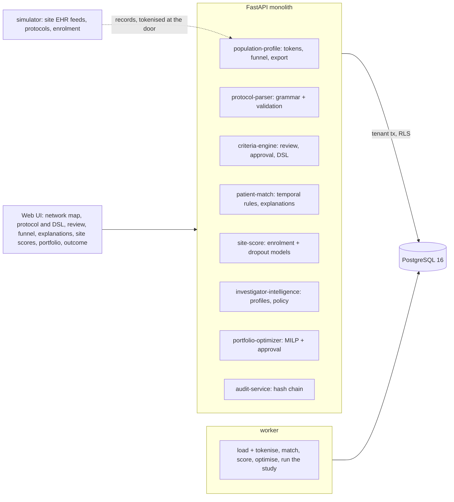

# AI Clinical Trial Recruitment & Site Optimization Network

For a sponsor's or CRO's feasibility team: it turns a protocol's eligibility section into executable rules with a deterministic
grammar and a person's review, finds the eligible patients in a research network's de-identified records with a rules engine that
reads time, scores every site on when it will open and how many evaluable patients it will enrol, picks a site portfolio under a
budget by mixed-integer programming for a second person to approve, and explains every eligibility decision criterion by criterion.

Built from blueprint 08 of "Advanced Engineering Build Book, Volume IV" as a **vertical slice**: the demo scenario end to end,
with the platform parts real and the rest listed under [Not built](#not-built-and-why).

**The network, its sites, investigators, patients, protocols and enrolment come from a simulator in this repository. No real patient,
site or investigator data is used, and no language model or outside service is called. The twelve months of enrolment are run by the
same simulator with its own truth, so the comparison of prediction and outcome is as right as the simulator, which here is the truth;
on a real network it would be the next study's results, a year later.**

## Run it

```bash
docker compose up --build        # migrates, seeds, serves http://localhost:8300/ui/ with one worker
docker compose run --rm test     # 13 tests against a throwaway database (about a minute)
```

Open http://localhost:8300/ui/ and press **Run all steps** (the recorded run took 34 seconds through the API), or `make bootstrap demo`.
Demo tokens (local only): `net-study_director-demo`, `net-feasibility_analyst-demo`, `net-viewer-demo`. Run `make reset` before a second demo run.

## The demo, step by step

1. An invented network of 120 oncology sites (36 academic, 84 community, six regions) with 263 investigators and five years of history:
   582 site-studies and 5,477 enrollees. Every site's EHR feed arrives with MRNs, birth dates, dated events and a free-text note, and is
   tokenised at the door: 37,893 records become tokens (a keyed hash, a 5-year age band, a distance band, 787,524 events as days before
   the snapshot); 788 events are refused with a reason (439 medication events for a blinded study drug no dictionary classifies, 227 haemoglobins in
   mmol/L, 122 events after the snapshot). Backtested on the history's latest 59 studies, the enrolment model is off by 2.42 patients per
   site and study against 4.51 for the site's historical average; 88% of actual counts fall inside its 80% intervals.
2. A phase 3 protocol, ONC-LUNG-301 (previously treated, PD-L1-positive NSCLC), 22 criteria, goes through the grammar: 16 become typed
   rules, 4 are left to the site (consent, RECIST, pregnancy, life expectancy), 2 go to review: "fewer than three prior regimens,
   counting maintenance as part of the preceding line" and "prior PD-1 or PD-L1 blockade within the last half year".
3. The study director's first edit types the ANC threshold as 1,500 in 10^9/L and is refused (422: "outside the plausible range
   0.3-5 10^9/L (a unit slip?)"). Then the two queued criteria are written by hand (at most two prior lines; PD-1 or PD-L1 antibody
   within 182 days), the other 20 accepted. 20 of 20 parser proposals accepted; 91% translated without help. The criteria are frozen.
4. The rules engine runs them over all 37,893 tokens: 20 patients are eligible today, 701 potentially eligible (mostly no ECOG within
   two weeks or no labs inside their window), 37,172 not; counting each potential patient by the chance its open criteria pass gives
   332 expected eligible patients, mapped by site, with the funnel criterion by criterion (7,836 with the diagnosis).
5. Three decisions explained: an eligible patient at S-002 (labs and ECOG on day -3); one at S-062 excluded by pembrolizumab, line 1,
   ended on day -155, inside the 182-day window; one at S-113 waiting on screening labs (the last on day -116). Each is re-derived from
   the stored timeline and checked against the stored decision. The analytics export has 2,036 rows, 1,110 cells suppressed under 11,
   and no dates, tokens or MRN-like numbers.
6. Every site scored: the model expects 417 enrolments across the 120 sites in 12 months, the historical average 1,145. Seven sites are
   excluded because their lead investigator has an open GCP finding. The MILP (OR-Tools SCIP, optimal in 28 ms) picks 20 sites for
   $2,398,522 of a $2,400,000 budget: 110.6 expected evaluable patients, 80% interval 94-128, P(at least 100) 81%. The same predictions
   picked greedily by value per dollar give 106.1 (71%); the top sites by historical enrolment fit only 18 sites into the budget, 10 of
   them academic, for 79.0 (6%). The analyst cannot approve (403); the study director approves.
7. The simulator runs twelve months: the plan's 20 sites enrol 101 patients, 13 drop out, **88 evaluable, below the plan's own interval
   and short of the 100 target**; 19 of 20 sites land inside their own 80% interval. The top-by-history sites, with the same draws per
   site, get 48. The chosen sites had 90.5 expected eligible patients by the engine's count and 81 truly eligible by the generator's: they
   were chosen because their estimates were high. The audit chain verifies.

## Architecture



| Piece | How it works |
|---|---|
| Simulator (`trials/world.py`) | Sites (type, region, records, competing trials, costs, slot capacity) with latent quality, retention and contracting speed; investigators with trials and publications by indication and an occasional open GCP finding. Patients by indication with dated diagnoses and staging, biomarkers (tested or not), regimens by line laid out in time, lab and ECOG histories that drift toward today's values, comorbidities, and what feeds really contain (a regimen given elsewhere, a blinded study drug, a unit nobody converts). Protocols from seven archetypes, each criterion written in one of several phrasings (some deliberately ambiguous) with its structured truth; a second set of phrasings exists only for the evaluation. Enrolment at a site: Weibull activation, Poisson months with a rate proportional to the truly eligible patients, slot cap, logistic dropout. Draws keyed by (seed, study, site), so a site enrols the same way in any portfolio. |
| Tokenisation | At ingest: SHA-256 of a tenant salt and the MRN, age band, distance band, events as days before the snapshot, labs in canonical units. Names, MRNs, birth dates, dates of care and free text never reach a table. |
| Criteria parser | A deterministic grammar over the normalised text: labs with comparator, number, unit and window; diagnosis and stage lists and ranges; biomarkers; ECOG; lines of therapy; drug classes with windows; conditions; topics no record can answer. Every word must be explained by a clause or be protocol boilerplate, otherwise the criterion goes to review; every rule passes a typed validation (known field, operator, unit, plausible range, a window on every lab). Baseline: a keyword spotter. |
| Review | A study director accepts, edits (validated like the parser's output) or marks each criterion manual; the set is frozen when all are reviewed, and only then runs on patients. |
| Temporal rules engine | Three-valued: a criterion is met, not met or unanswerable today. A lab or ECOG counts only inside its window, a regimen only if it ended inside the exclusion window, an untested biomarker is unknown. A potential patient counts by the product of the open criteria's pass rates among patients whose record does answer, by on-treatment stratum (labs are measured during treatment, so missing is not at random). Explanations are re-derived from the stored timeline and checked against the stored decision and its hashes. Baseline: the same rules without time. |
| Enrolment model | Negative binomial: rate per expected eligible patient-month from site type, competing trials and the lead investigator's trials in the indication, studies that filled their slots treated as censored; a gamma frailty per site from its own history; the coefficients' uncertainty drawn jointly for all sites. Times the months open, from a Weibull activation model by site type with each site's contracting history shrunk toward it. 2,000 predictive draws per site. Baseline: the site's historical average per study. |
| Dropout model | Logistic regression on ECOG, age band, distance band, prior lines, comorbidities and the site's past retention (leave-own-study-out). Baseline: the base rate. |
| Portfolio | MILP: exactly N sites, maximise expected evaluable patients, budget on activation plus per-patient fees at expected enrolment, regional caps, academic minimum, no site whose lead investigator has an open finding. Baselines: the top sites by historical enrolment and a greedy pick by value per dollar, both under the same budget and cost model. Intervals and P(target) from the predictive draws. A proposal until a second person approves. |
| Platform | Row-level security per tenant on every table, Postgres job queue with retries and a dead-letter view, Idempotency-Key replay, hash-chained audit log (including every explanation viewed and every export), model artifacts with backtest metrics and data snapshot, every inference logged with model version and input hash, `/metrics`. |

## Data model

`migrations/002_trials.sql` follows the blueprint (study, criterion, site, investigator, population_bucket, patient_token,
eligibility_event, site_metric, site_score, portfolio_plan); additions are marked `(+)`: the network with its seed, snapshot date and
token salt, past enrollees' banded features, the simulated study run, model artifacts and runs. A patient is one `patient_token` row
whose timeline is one bounded JSON array of de-identified events; analytics read `population_bucket`, which holds counts only.

## API

| Method | Endpoint | Purpose |
|---|---|---|
| POST | `/v1/studies/parse` | Protocol text to the criteria DSL with validation; the review queue for what the grammar cannot account for |
| POST | `/v1/match/evaluate` | 202 + job: the approved criteria over every token; eligible, potential or ineligible, criterion by criterion |
| POST | `/v1/sites/score` | 202 + job: pool, activation, enrolment with an interval, dropout, evaluable patients, investigator profile, baseline |
| POST | `/v1/portfolios/optimize` | 202 + job: the MILP portfolio against two baselines, intervals and P(target); a proposal |
| GET | `/v1/studies/{id}/funnel` | Attrition in protocol order, pools by site, what potential patients wait on |
| GET | `/v1/matches/{id}/explanation` | Each criterion's rule, value and evidence (days before the snapshot), re-derived and checked |
| POST | `/v1/studies/{id}/review` · GET `/v1/studies/{id}` | (+) Accept, edit or mark manual; approval freezes the criteria |
| GET | `/v1/studies/{id}/matches` · `/v1/studies/{id}/export` | (+) Matches by status or criterion; the analytics export with small cells suppressed and an identifier scan |
| POST | `/v1/portfolios/{id}/approve` · GET `/v1/portfolios/{id}` | (+) A study director approves; the proposer cannot |
| GET | `/v1/network/overview` · `/v1/sites/{id}` | (+) Command centre and site drill-down with history and investigators |
| POST | `/v1/network:load` · `/v1/network:advance` | (+) 202 + job: load and tokenise the network; the simulator runs the study at the approved sites |

Contract: [`docs/openapi.json`](docs/openapi.json).

## Measured

[`docs/evaluation.md`](docs/evaluation.md) (`python -m trials.evaluate`, three networks the demo never uses, four protocols each, and
480 generated protocols for the parser) and [`docs/performance.md`](docs/performance.md).

| Component | Result | Baseline |
|---|---|---|
| Criteria translated exactly, wording the grammar was written against | 97.7% of 3,660, 2.3% to review, 0 wrong | keyword spotter 42.0% |
| … wording never shown to the grammar | 9.0%, 91.0% to review, 0 wrong | keyword spotter 26.3% |
| Translation acceptance after review (blueprint bar: 95%) | every proposal correct (0 of 3,905 wrong); 20 of 20 accepted in the demo | |
| Criterion values correct when the record answers | 99.65-99.81% | same rules without time 94.44-95.73% |
| Truly eligible patients found (eligible or needs screening) | 98-100% | without time 0% (27-32% on two HER2 protocols) |
| Expected eligible against truly eligible, per protocol | -8% to +11% | |
| Site enrolment in 12 months, error per site | 1.06-2.19 patients | historical average 5.18-8.63 |
| … rank correlation with what sites enrolled | 0.54-0.82 | 0.20-0.49 |
| … calibration, 80% intervals on sites expecting 3+ (agreed bounds 70-90%) | 76-96%; 8 of 12 protocols inside, 4 slightly wide | |
| Dropout risk, AUC / Brier | 0.62-0.65 / 0.165-0.173 | base rate Brier 0.173-0.181 |
| Evaluable patients from 20-site portfolios, 12 protocols | 1,286 | top 20 by history 1,012; greedy on the same predictions 1,268; hindsight 1,775 |
| Optimisation for 1,000 candidate sites (bar: 2 minutes) | 2.7 s end to end, the MILP 0.08 s | |
| PHI in analytics exports | none: tested against every MRN and birth date the feeds sent | |

Three things these numbers say plainly. The parser's "zero wrong" is a property of abstaining, not of understanding: on wording it was
not written against it translates one criterion in eleven and leaves the rest to the reviewer, which is what a grammar does and why
the acceptance rate and the coverage have to be reported together. The portfolio's gain over the historical baseline comes from the
prediction (this protocol's pool at each site), not from the MILP, which matches a greedy pick on the same predictions and earns its
place by keeping the regional and academic rules. And the portfolio totals are over-confident: they landed inside their own 80%
interval 7 times in 12, and the demo's plan delivered 88 against 94-128, because the optimiser picks the sites whose pool estimates
came out high.

## The hardest tradeoff

What to do with a patient the record cannot answer about. A protocol asks for labs within 14 or 28 days and an ECOG within two weeks;
most patients off treatment have neither. Counting them as ineligible (what a strict query does) finds 20 patients in the demo where
the generator knows of 322 (the engine's estimate: 332), and makes every site look empty; counting them as eligible floods the pool with patients who will
fail screening. The engine keeps a third state, "potentially eligible", says which criterion each one is waiting on, and weighs them
by how often patients whose record does answer pass that criterion, separately for patients on and off treatment, because labs are
drawn during treatment and treatment moves them. In an earlier run without that split the estimates on the first held-out network
were 8-18% low; with it the twelve held-out protocols land between 8% low and 11% high. The cost is that the pool is an estimate with its own error, and the portfolio, which chooses the sites where the estimate is
highest, inherits the high side of that error: the optimiser's curse that the demo's twelve months show.

## Threat model (summary)

| Threat | Mitigation here | Gap |
|---|---|---|
| Re-identification from the patient store or exports | Tokenisation at ingest (keyed hash, age and distance bands, day offsets, no text); exports are counts with cells under 11 suppressed and a scan for dates, tokens and MRN-like numbers before they leave; tested against every identifier the feeds sent | No formal k-anonymity on combinations of band and site; the salt lives in the database |
| A mistranslated criterion run on patients | The grammar abstains rather than guesses; every rule (parsed or edited) is validated; nothing runs until a study director has reviewed every criterion; the criteria are then frozen and hashed into every decision | One reviewer |
| A site portfolio committed without a second look | A plan is a proposal with its baselines, constraints and intervals; only a study director who did not propose it can approve; both in the audit chain | No budget authority beyond the role |
| One sponsor seeing another's network or patients | Row-level security on every table, tested through the API and in the database; patient-level explanations need an analyst role | |
| A decision nobody can trace | Every eligibility event carries the engine version, criteria hash and record hash; explanations re-derive and check them; every score logs model version and input hash | No promotion workflow beyond `approved` |

## Not built, and why

- **A language model for the criteria (the blueprint's "LLM-to-DSL")**: no model or API is called; the parser is a deterministic
  grammar with validation and a review queue. A model would raise coverage on unseen wording (9% here) but would also produce
  confident mistranslations, which this design is built to make impossible; and a slice that runs offline, reproducibly, against
  patients' eligibility should prove the review loop and the DSL before trusting a generator. The DSL and the validation are where a
  model would plug in, as one more proposer whose output is checked like the grammar's.
- **FHIR ingestion, pgvector, Spark, MLflow**: the feeds are the simulator's JSON records shaped like an EHR extract; nothing here needs
  vector search; the volumes fit Postgres; the model registry is a table.
- **Real investigator publications and disease prevalence data**: investigator intelligence is trials and publications counts by
  indication and an inspection flag from the simulator.
- **Kafka/NATS, Kubernetes, Terraform, OIDC/SSO and SCIM, SSE progress, a React front end**: not needed to prove the slice (jobs are
  polled). No cloud account used.

## Commercial sketch

Buyers: pharma, biotech, CROs and trial networks. Pricing shape from the blueprint: per study plus a site-portfolio fee plus matching
volume, with a private deployment for enterprises. The ROI line a buyer asks for is the evaluation's portfolio row: under the same
budget, sites chosen on this protocol's pool enrolled 27% more evaluable patients than sites chosen on their history, and every
non-enrolling site avoided is an activation fee saved.

## Layout

```
core/        platform kit: db + RLS, jobs, audit chain, HTTP, scenario runner, load test
trials/      world (network, patients, protocols, enrolment), engine (tokenise, parser, rules engine, models, MILP), api, seed, evaluate
migrations/  forward-only SQL          web/   UI, scenario.json, demo.json (recorded run)
tests/       13 tests                  docs/  evaluation.md, performance.md, openapi.json
```
