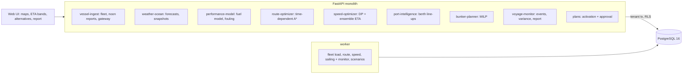

# Ocean Shipping Fuel & Voyage Optimization Engine

For a container line's operations desk. It fits a fuel model for each ship from its noon reports and tracks how much its
fouled hull costs. It routes a crossing through the forecast and sets the speed for every leg against the berth window,
with an ETA band from a forecast ensemble, and plans where to buy bunkers. While the ship is at sea it watches for storms
on the track and congestion at the port. It compares route and speed alternatives on fuel, ETA, CO2 and the charter
penalty, and sends any change beyond the charter terms to a second person. At berthing it measures what the voyage saved
against the same voyage sailed the plain way through the same weather.

Built from blueprint 09 of "Advanced Engineering Build Book, Volume IV" as a **vertical slice**: the demo scenario end to end,
with the platform parts real and the rest listed under [Not built](#not-built-and-why).

**The ocean, its weather, storms and currents, the ships and every report they file come from a simulator in this
repository. No real vessel, AIS, noon-report or weather data is used. The demo's storm and Rotterdam's congestion are
injected by telling the simulator; the planners only ever see forecasts, port line-ups and the ships' own reports. The
savings are measured against a baseline the simulator re-sails, so they are as right as its physics. On real ships the
same comparison runs on the fitted fuel model and reanalysis weather, which the voyage report also shows.**

## Run it

```bash
docker compose up --build        # migrates, seeds, serves http://localhost:8310/ui/ with one worker
docker compose run --rm test     # 13 tests against a throwaway database
```

Open http://localhost:8310/ui/ and press **Run all steps** (the recorded run took 54 seconds through the API), or `make bootstrap demo`.
Demo tokens (local only): `northline-operator-demo`, `northline-master-demo`, `northline-viewer-demo`. Run `make reset` before a second demo run.

## The demo, step by step

1. An invented line with six container ships after a year of crossings between New York, Norfolk or Halifax and
   Rotterdam, Antwerp, Le Havre or Hamburg: 194 voyages, 1,710 noon reports, 7,105 AIS positions. Each ship's fuel model
   is fitted on ten months and scored on the last two. Its daily fuel error is 2.3-3.0% against 4.7-18.1% for the yard's
   sea-trial curve (blueprint bar: 7%). Atlantic Sage has gone 560 days since her hull was cleaned, and the model puts the
   fouling at 20.3% extra fuel at service speed. Two noon reports arrive through the gateway. One is accepted (47.5 t against
   49.5 t predicted). The other is refused: 410 t is 8.3 times what the model expects for that speed and sea.
2. Atlantic Sage is to sail New York to Rotterdam, 90% loaded. The charter gives a berth window from 14 October 12:00 to
   16 October 00:00, hire of $28,000 a day, fuel at $620 a tonne, carbon at $80 a tonne on half her CO2, $3,000 an hour
   late, and 12 hours of ETA tolerance. The route optimiser solves the grid in 1.5 s at 15 kn (the speed that lands
   mid-window). This week's forecast gives no reason to leave the shortest sea route (3,310 nm). The A* route (3,333 nm)
   sails at $541,746 through the forecast against $538,741 for the shortest, so the shortest is kept.
3. The speed plan's first try put its P90 arrival at 16 October 05:50, after the window. It tightened its own deadline once:
   P50 15 October 18:23, P90 23:51. Orders run 13.25-15 kn. Expected: 356 t of fuel, 1,111 t of CO2 and $545,227. Service
   speed would arrive on 13 October, wait a day for the window, and burn 541 t for $647,042. Inside the charter terms, so the
   plan is activated without an approval. The bunker MILP buys 1,095 t at Rotterdam ($578) rather than New York ($640):
   $639,141 against $707,033 for topping up at every call.
4. The simulator is told that a storm (28 m/s) forms 60 hours out and crosses her track around day four, and that
   Rotterdam cannot berth her before 17 October 06:00. She sails two days (629 nm, 63.3 t metered against 64.2 t planned).
   The monitor's first daily check raises two events. The forecast puts 7.1 m seas on her track on 9 October. Rotterdam
   has 17 ships at anchor and an earliest berth 25 hours after her P50 arrival.
5. Four alternatives from her position, sailed through the new forecast's 24 members:

   | | ETA change | Fuel | CO2 | At anchor | Expected cost | Worst sea | Charter terms |
   |---|---|---|---|---|---|---|---|
   | Keep the plan | +8.8 h | 297 t | 942 t | 25.5 h | $483,454 | 10.4 m | inside |
   | Hold the notified ETA | −1.1 h | 346 t | 1,087 t | 36.0 h | $518,146 | 5.2 m | inside |
   | Re-speed on the same route | +28.1 h | 267 t | 835 t | 6.7 h | $459,089 | 7.4 m | needs approval |
   | Re-route and re-speed | +31.1 h | 264 t | 815 t | 3.5 h | $452,977 | 5.9 m | needs approval |

   Holding the ETA only buys a day and a half at anchor; keeping the plan sails into 10 m seas to wait a day; re-routing south
   of the storm and slowing to Rotterdam's berth is the cheapest and the calmest.
6. The operator puts the re-route forward. It moves the ETA 31 hours, beyond the 12-hour tolerance, so it becomes a proposal.
   The operator's own approval is refused (403 `proposer_cannot_approve`), and the master approves. The charterer's ETA
   becomes 17 October 01:27.
7. She arrives at 01:23, inside the approved plan's band (P50 01:27, P90 03:27), after 2,914 nm. She berths at 06:00 after
   4.6 hours at anchor, having burned 326 t for $557,965. The weather-normalised baseline sails the shortest route at
   service speed through the same weather, storm included. It arrives on 13 October and waits 92 hours: 538 t and $715,187
   by the simulator's truth. Saved: 211 t of fuel (39.3%), 658 t of CO2 and $157,222 (22.0%). The fuel model on reanalysis
   weather, which is what a real deployment would compute, says 227 t and $168,756. The monitor raised one event on the
   way: on 15 October that day's Rotterdam line-up put the berth at 16 October 23:49, before her P90. Over the whole voyage,
   plan against actual is 325.4 t against 325.8 t metered.

## Architecture



| Piece | How it works |
|---|---|
| Simulator (`voyage/world.py`) | A 0.5-degree North Atlantic (7,283 ocean nodes, coarse coastlines). The weather is westerlies with travelling meanders, plus storms: lows that form off North America, run east-north-east for three to six days, and carry a cyclonic wind field and their own sea. Waves follow the wind. The Gulf Stream and North Atlantic Current are a fixed jet. Each ship has its own true speed-power curve (exponent 2.9-3.3), added resistance in waves (head seas worst) and wind, fouling that grows with days since cleaning, an engine that burns more per kWh at low load, and auxiliaries. A speed order is an engine setting, so weather costs time, not fuel per hour; the master slows further in heavy head seas. Forecasts are the truth with errors that grow with lead time, and they cannot contain storms that form more than 48 hours after issue. Ensemble members add their own late storms from the same climatology. Everything is a function of (seed, time). |
| Fuel model | Per vessel, non-negative least squares on physically shaped features of each noon report: speed squared, cubed and to the fourth scaled by displacement, speed cubed times days since cleaning (fouling), wave height squared by heading, and apparent head wind. A report the model cannot explain is dropped. Baseline: the sea-trial curve. |
| Route optimiser | Time-dependent A* at a speed order: each edge costs the model's burn in the forecast at the hour the ship would be there, the current along it, hire and a heavy-weather charge; edges into seas above 7 m are closed. The lattice path is smoothed into great-circle legs (within 30 nm of it, so the route keeps its shape). Then it and the shortest sea route are sailed through the forecast and the cheaper is kept. |
| Speed optimiser | Dynamic programming over arrival time, legs of about 120 nm, orders in 0.25-knot steps. It minimises fuel and carbon, hire to berthing, waiting at anchor and the late penalty, which never applies to waiting the port causes. It keeps its ensemble P90 inside the window or the port's earliest berth, tightening its own deadline until it does. |
| ETA band | The plan is sailed through 24 forecast members with the fuel model, each member also drawing the model's voyage-level error: P10/P50/P90 arrival and fuel. |
| Monitor and decisions | The ship sails in daily steps. After each, the monitor reads a fresh forecast and the port line-up and raises or closes events: a storm on the track, congestion, ETA at risk. A plan inside the charter terms activates; one that moves the ETA beyond the tolerance, or risks the window, needs a second person (master or operator, never the proposer). |
| Platform | Row-level security per tenant on every table, a Postgres job queue with retries and a dead-letter view, Idempotency-Key replay, a hash-chained audit log, model artifacts with metrics and data snapshot, and every inference logged with model version and input hash. Also `/metrics`. |

## Data model

`migrations/002_voyage.sql` follows the blueprint (vessel, voyage, position, weather_cell, engine_sample, fuel_sample,
port_call, route_plan, speed_plan, bunker_plan, voyage_event, model_artifact, decision_record). Additions are marked `(+)`:
the fleet with its simulator seed, clock and what the generator was told, the voyage's state and notified ETA, the voyage
report, and scenarios. Telemetry is bounded. Engine samples and AIS are hourly for live voyages and AIS is six-hourly for
the history. A forecast snapshot is one array of wave heights per valid time, never a row per grid cell.

## API

| Method | Endpoint | Purpose |
|---|---|---|
| POST | `/v1/voyages` | A voyage: vessel, ports, load, charter terms (window, hire, late penalty, ETA tolerance, fuel and carbon prices) |
| POST | `/v1/routes/optimize` | 202 + job: weather routing against the shortest sea route at the same speed, solve time, forecast map |
| POST | `/v1/speed/optimize` | 202 + job: speed orders by leg, ETA band, fuel, CO2, expected cost, against constant service speed |
| POST | `/v1/bunker/plan` | MILP over the next calls against topping up at every call |
| GET | `/v1/voyages/{id}/variance` | Plan against actual: fuel split into speed, weather and model; daily rows; ETA drift |
| POST | `/v1/scenarios` | 202 + job: route and speed alternatives from the ship's position, side by side, each a candidate plan |
| POST | `/v1/plans/{id}/activate` · `/v1/decisions/{id}/approve` | (+) Activate inside the terms, otherwise propose; a second person approves |
| POST | `/v1/noon-reports` | (+) The reporting gateway: validated, scored by the fuel model, implausible figures refused with the reason |
| GET | `/v1/fleet` · `/v1/vessels/{ref}/performance` · `/v1/voyages/{id}` | (+) Command centre, fuel against speed, voyage detail and report |
| POST | `/v1/fleet:load` · `/v1/voyages/{id}:advance` | (+) 202 + job: load the fleet; sail the ship, optionally telling the simulator about a storm or congestion |

Contract: [`docs/openapi.json`](docs/openapi.json).

## Measured

[`docs/evaluation.md`](docs/evaluation.md) (`python -m voyage.evaluate`, three worlds the demo never uses: other weather,
other ships, 36 ordinary, 24 storm and 18 congestion voyages) and [`docs/performance.md`](docs/performance.md).

| Component | Result | Baseline |
|---|---|---|
| Daily fuel, MAPE on the last 60 days, 18 vessels | 2.0-3.5% (blueprint bar: 7%) | sea-trial curve 3.5-17.0% |
| Hull fouling now (extra fuel at service speed) | off by 0.9 points median, 4.3 worst | assume clean: off by 2.4-19.3 |
| Voyage cost, ordinary voyages, sailed through the realised weather | $21.84M | shortest route at service speed (the weather-normalised baseline) $25.01M (−12.7%); careful constant speed $22.21M (−1.7%) |
| Fuel and CO2, the same | 17,496 t | 23,124 t (−24.3%); 18,387 t |
| Weather routing alone, at service speed | 0.34% dearer on average | shortest route |
| ETA: realised arrival at or before P50 / P90 | 39% / 89% | deterministic forecast 39%; plus 6 h 89% |
| Voyage fuel, plan P50 against burned | MAPE 1.3% | |
| Route solve, 132 solves | median 1.7 s, worst 3.0 s (blueprint bar: 30 s) | |
| Storm voyages: re-routed and re-speeded at day two | 101 hours in seas above 6 m, 3 of 24 late | plan kept: 581 hours, 12 late; cost 0.4% higher |
| Congestion voyages: re-speeded to the berth | 8,026 t | waiting at anchor 9,475 t (−15.3%) |
| Bunkers, 36 plans | $1,276,001 saved, 0.7% median | top up at every call |

Three things these numbers say plainly. Almost all the saving is speed: sailing at service speed to wait for a berth is
what the baseline does, and against a master who picks one sensible speed for the window the optimiser saves 1.7% and is
dearer on 9 of 36 voyages. Weather routing does not pay in ordinary weather. At service speed the route the forecast
prefers was 0.34% dearer on average in the weather that came. In storms it buys the sea the ship does not meet: 101 hours
above 6 m instead of 581, for about the same money. And the ETA band's P90 is calibrated (89%), but on ordinary voyages
a fixed six-hour margin covered as often. The ensemble earns its place by a band that widens with the weather
(1.4 to 17.7 hours here) and by the storms beyond the forecast's horizon, which a single forecast cannot contain.

## The hardest tradeoff

What a speed order means. The first version held speed through the water: weather showed up as extra fuel, ETAs barely
moved, and the ETA band was minutes wide while the real arrival missed it by hours. Ships are run on an engine setting, so
here an order is the power that gives that speed in calm water, and weather costs time. That made the ETA band real, and
it exposed the next problem. Every planner's forecast was missing the storms that form after its horizon, so the band was
still too narrow (in one test crossing the real arrival came 12 hours after the band's P90). Ensemble members now carry storms of their own from the
same climatology. The cost is that a plan's P90 is now often later than its deterministic ETA, so the speed plan has to
tighten its own deadline to keep the P90 inside the window, and it sails faster than a deterministic optimiser would.

## Threat model (summary)

| Threat | Mitigation here | Gap |
|---|---|---|
| A mistyped or forged noon report teaching the fuel model wrong | Each report is validated on its own and scored by its vessel's model; more than 35% off is refused with the reason, never learned from; outliers are dropped from fitting | No signing of ship messages beyond the API token |
| An ETA change the charterer was not told of | A plan beyond the tolerance or the window is a proposal; only a second person (master or operator) approves it; both are in the hash-chained audit log | One approver |
| One operator seeing another's fleet, positions or fuel | Row-level security on every table, tested through the API and in the database | |
| A plan made on stale data | A plan made before the ship moved, or for a closed voyage, is refused (`plan_stale`, `voyage_closed`); every plan logs its forecast issue time, model version and input hash | No freshness policy on the weather provider itself |

## Not built, and why

- **Real weather (GRIB/xarray), PostGIS, a MapLibre/deck.gl map**: the simulator's fields are evaluated directly and the
  grid is a numpy array. An SVG map shows everything the demo needs.
- **PyTorch or a learned speed-power model**: a physically shaped least-squares fit reached 2.0-3.5% on held-out noon
  reports. The remaining error is the reports' own noise, not model capacity.
- **Automatic re-speeding within the charter terms**: it was built and removed. Re-planning every day on each new forecast
  swung the ETA by ±20 hours as the storm moved in the forecasts, and the held-out evaluation never tested it. The monitor
  raises events and a person decides.
- **Rust, Kafka, TimescaleDB, Kubernetes, Terraform, SSO**: not needed to prove the slice. High-frequency engine telemetry
  for a large fleet belongs in a time-series store, not the OLTP table here. No cloud account was used.

The demo's world (seed 13) was chosen because the weather after day four of its crossing is quiet. Seed 7 put a second
storm, which nobody re-planned for, across the end of the voyage. The injected storm and congestion are then the story. The
held-out evaluation covers ordinary weather and storms on other seeds.

## Commercial sketch

Buyer: ship owners, operators, charterers and fleet managers. Pricing shape from the blueprint: per vessel per month plus a
share of verified savings. The voyage report is that verification: fuel, CO2 and cost against the same voyage sailed the
plain way through the same weather, measured with the vessel's own model on reanalysis.

## Layout

```
core/        platform kit: db + RLS, jobs, audit chain, HTTP, scenario runner, load test
voyage/      world (ocean, weather, ships), engine (fuel model, A*, speed DP, ensemble, MILP), api, seed, evaluate
migrations/  forward-only SQL          web/   UI, scenario.json, demo.json (recorded run)
tests/       13 tests                  docs/  evaluation.md, performance.md, openapi.json
```
