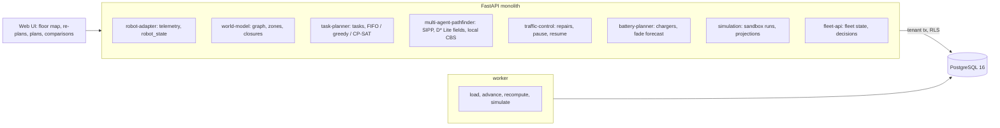

# Autonomous Warehouse Robotics Orchestration

For a fulfilment operator running a fleet of mobile robots: it hands out every order to a robot every few seconds, plans each
robot's whole job (to the pick face, to a pack station, home) against every other robot's path so that no two ever meet,
re-plans the robots an event touches the moment an aisle closes, a charger fails or an operator stops a robot, forecasts each
battery's fade, and puts any plan that takes robots off their work in front of a second person, with a projection of what it
gains and costs.

Built from blueprint 02 of "Advanced Engineering Build Book, Volume IV" as a **vertical slice**: the demo scenario end to end,
with the platform parts real and the rest listed under [Not built](#not-built-and-why).

**The warehouse, its 250 robots, their batteries, the orders and the disruptions come from a simulator in this repository. No
real warehouse or fleet data is used. The floor executes moves exactly as commanded (no wheel slip, no late starts, no
kinematics beyond one cell a second), so the collision-free result below is the planner's, not a robot's.**

## Run it

```bash
docker compose up --build        # migrates, seeds, serves http://localhost:8240/ui/ with one worker
docker compose run --rm test     # 15 tests against a throwaway database
```

Open http://localhost:8240/ui/ and press **Run all steps** (about a minute), or `make bootstrap demo`.
Demo tokens (local only): `wh-shift_manager-demo`, `wh-fleet_engineer-demo`, `wh-viewer-demo`. Run `make reset` before a second demo run.

## The demo, step by step

1. An invented fulfilment centre, 160 × 59 m: 123 single-width aisles with 1,476 pick faces in three storage blocks, two-cell
   travel highways between groups of aisles, 20 pack stations, 24 chargers and 250 robots from three invented vendors (125, 68
   and 57), 26 of them below 25% charge. 168,622 battery cycles: the fade model, fitted with the last 120 days of each pack held
   out, is off by 0.28 points of state of health against 0.76 for each pack's own trend, and names four packs that reach 80%
   within 180 days (one already has).
2. The generator is told the peak has begun: 9,000 orders an hour. In five minutes 745 orders arrive and 488 are delivered
   (5,856 an hour across the window, which includes the first 90 seconds of robots leaving their bays), at 71.6 cells (86 m)
   of travel per order, with 0 collisions in 75,000 robot-steps checked.
3. Aisle C-14 closes at 5:10 (9 robots re-planned in 64 ms) and B-27 at 5:40 (7 robots in 60 ms); charger CH-05 fails at 6:10
   and the robot on it rejoins a queue of 7. Over the 150 seconds 343 orders are delivered (8,232 an hour) at 52.6 cells each,
   7 orders whose pick face is in a closed aisle are held rather than failed, and 0 collisions in 37,500 robot-steps.
4. An operator stops R-030, the robot in the aisle cell the most robots are due through. The 4 robots due through it within 30
   seconds are re-planned in 24 ms (two of them, bound for a pick face beyond it, give way and hand their orders back to the
   queue); the 8 due later are re-planned at the next dispatch epoch.
5. Five urgent orders with a two-minute SLA arrive deep in block A, far from the stations; a sixth with a location that does
   not exist is refused. The recompute projects both plans four minutes ahead on a copy of the floor that knows no future
   orders: keeping the current plan gets 3 of 5 out on time (one late by 1 s, one by 20 s); taking 4 robots off ordinary orders
   gets 5 of 5, and those 4 orders still finish within their own SLA (in 58, 124, 107 and 94 s instead of 55, 46, 91 and 74).
   It becomes a proposal.
6. The engineer cannot approve it; the shift manager does, and R-030 is released. In four more minutes the urgent orders are
   delivered in 116, 103, 98, 96 and 98 seconds, as projected, and 535 orders in all (8,025 an hour), 0 collisions in 60,000
   robot-steps. At 11:30, 1,366 orders delivered since the peak began, all within SLA, 24 held behind the closed aisles.
7. The same shift start, the same 1,111 orders and the same disruptions run in a sandbox under three dispatchers. FIFO (the
   oldest order to the nearest free robot): 77.9 cells per order, 6,152 orders an hour. Greedy best pair: 64.3 and 6,608. CP-SAT:
   63.7 and 6,648, 18.2% less travel and 8.1% more throughput than FIFO; 0 collisions in 112,500 robot-steps each. Then the
   audit trail.

## Architecture



| Piece | How it works |
|---|---|
| Simulator (`wh/world.py`) | A grid graph of 3,452 cells (1.2 m): parking lanes with bays and chargers, two-cell cross-aisles, three blocks of single-width picking aisles, two-cell highways between groups of aisles, pack stations. Bays are dead ends only their robot may enter. Each second the floor moves every robot as commanded and its checker looks for a vertex conflict, an edge swap, a move into a closed aisle from outside, a paused robot moving or a move off the graph. Batteries drain with what a robot does and charge on a working charger; each pack fades by hidden vendor and per-pack parameters (one in eight with an unmodelled knee). Orders arrive by Poisson at the rate the generator is told, skewed to fast movers near the stations; closures and charger faults happen when it is told. Every draw is keyed by seed and purpose, and runs are deterministic. |
| Space-time planning | Safe Interval Path Planning: a space-time A* whose states are (cell, safe interval), so waiting costs nothing to search, against a reservation table of every committed plan (cell-time, edge-time and parked-from-t), with a weighted heuristic (arrival at most 30% later than the best). A robot's job is a chain of legs; when a leg cannot start where the previous one ended (a robot queued at a dead-end station's only entrance), the previous leg's search yields its next solution. |
| Distance fields | Each goal's exact distance around the known obstacles (closed aisles, paused robots) is the search's heuristic, kept by D* Lite's incremental backward search (g/rhs), repaired in place when obstacles change and run to convergence because one field serves every robot heading to that goal. |
| Repairs | After an event, the robots it touches are re-planned in priority order while the others keep their plans; unplanned robots wait in place, which later plans respect. A robot that cannot be planned gives way (an unpicked order goes back to the queue, a loaded robot takes another station); one that must still wait pulls in the robots due through its cell; the last resort re-plans everyone. Groups of three or fewer go to Conflict-Based Search first. After a stop, robots due through the cell within 30 s are re-planned at once and the rest at the next epoch. |
| Assignment | Every three seconds: free robots, open orders and pack stations. FIFO gives the oldest order the nearest free robot; greedy pairs the best robot-order pairs; CP-SAT solves robots × orders × stations at once with station capacity, maximising a value (a base, more as the due time nears, urgent above all) minus empty travel, loaded travel and a station-queue penalty. Energy feasibility checked per pair. |
| Preemption | For open urgent orders, a small CP-SAT over free robots and robots heading to an ordinary pick, with a 20-cell cost per bump. Both plans run forward 240 s on a copy of the floor with no future orders or events; if preemption gets more urgent orders out on time, it is proposed, and taking robots off their work needs a shift manager who did not propose it. A plan computed against an older floor is refused as stale. |
| Batteries | Fade = θ·√(cumulative cycle stress) + κ·age, stress weighting deeper and hotter cycles; κ and a vendor θ pooled, each pack's θ shrunk toward its vendor's. Baseline: a line through the pack's last 90 days. Below 25% charge a robot queues for the nearest free charger; it leaves at 60%. |
| Platform | Row-level security per tenant on every table, Postgres job queue with retries and a dead-letter view, Idempotency-Key replay, hash-chained audit log, every assignment logged with policy, solver version and inputs hash, model artifacts with their backtest, `/metrics`. |

## Data model

`migrations/002_wh.sql` follows the blueprint (warehouse, zone, node, edge, robot, robot_state, task, task_assignment,
route_plan, conflict, charger, battery_cycle, simulation_run, plus model artifacts, model runs and decision records); additions
are marked `(+)`: world events, the generator's seed, clock and what it was told, and the pickled floor and orchestrator state
with a version a decision is checked against. Telemetry is never stored per step: `robot_state` is each robot's latest report,
and a run's trajectories survive only as a heat map and 30-second counts in its result.

## API

| Method | Endpoint | Purpose |
|---|---|---|
| POST | `/v1/tasks` | Orders from the WMS: location, priority, due time; validated one by one; an order in a closed aisle is held |
| GET | `/v1/fleet/state` | Every robot's cell, status, charge and task; chargers and queue; closed aisles; order KPIs; telemetry age |
| POST | `/v1/plans/recompute` | 202 + job: the current plan and a preemptive one projected forward for the open urgent orders; a proposal if it bumps robots |
| POST | `/v1/simulations` | 202 + job: the same shift start, orders and events under each dispatcher, compared |
| POST | `/v1/robots/{id}/pause` | Stop a robot; the robots due through its cell are re-planned at once, with the latency and before/after paths |
| POST | `/v1/robots/{id}/resume` · `/v1/decisions/{id}/approve` | (+) Release a robot; a shift manager approves or rejects a proposal |
| GET | `/v1/robots/{id}` · `/v1/batteries` · `/v1/tasks` · `/v1/conflicts` · `/v1/warehouse/map` | (+) Drill-down, fade forecasts, the order queue, re-plans and checker findings, the layout |
| POST | `/v1/warehouse:load` · `/v1/fleet:advance` | (+) 202 + job: load the warehouse; run the floor forward, optionally telling the generator a rate and events |

Contract: [`docs/openapi.json`](docs/openapi.json).

## Measured

[`docs/evaluation.md`](docs/evaluation.md) (`python -m wh.evaluate`, three warehouses the demo never uses, a steady and a peak
wave of 15 minutes each under three dispatchers) and [`docs/performance.md`](docs/performance.md).

| Component | Result | Baseline |
|---|---|---|
| Collision-free invariant, 18 runs | 0 conflicts in 4,050,000 robot-steps (blueprint bar: 99.99%) | |
| Travel per order, peak waves | 22.7–26.2% less than FIFO (bar: more than 15%) | FIFO nearest-free |
| Travel per order, steady waves | 1.7–2.0% less than FIFO (bar not met) | FIFO nearest-free |
| Throughput, peak waves | +8.7% to +9.3% | FIFO nearest-free |
| CP-SAT against greedy best pair, peak | −4.6% to +0.2% travel per order | greedy |
| Local re-plan after a robot stops, 72 worst-case stops | p50 34 ms, p95 204 ms; 69 of 72 under 250 ms (bar: 250 ms) | |
| … per affected robot | p50 4.9 ms, p95 38.2 ms, max 110.8 ms | |
| Simulated seconds slower than one second (freshness bar: 1 s) | 0 of 2,700 timed alone; 1 of 16,200 in the parallel runs | |
| CBS on a stopped robot's group | solved 7 of 8 groups of two, 2 of 8 of four, 0 of 48 of six to 32 | prioritized: 64 of 64 |
| D* Lite repair of a distance field | 0.02 ms (one cell) and 0.05 ms (an aisle), 0 mismatches | recompute 0.78 / 0.80 ms |
| Battery fade, 120 days ahead | 0.14–0.33 points of state of health | own trend 0.47–0.57 |
| … 365 days ahead | 0.28–0.67 points | own trend 2.28–2.32 |

Three things these numbers say plainly. The distance bar is met only when orders pile up beyond what the fleet can finish:
at a load it keeps up with, the nearest free robot is already about right for the oldest order and there is 2% to gain. Most of
the gain at peak is choosing, for each free robot, an order near it, which a greedy pairing does nearly as well as CP-SAT; the
joint solve adds a few percent at most and costs several times the solver time. And CBS does not scale here: past two or
three robots in a dense aisle it stops finishing, so the system leans on prioritized planning with give-way and pull-in steps,
which solved every group it was given, and keeps CBS for the small ones.

## The hardest tradeoff

What a robot does when it cannot find a path. Waiting where it stands is always safe, because every later plan respects it,
but two waiting robots can block each other for good; the first version also marked waiting robots as walls in the distance
fields, and in a stress test the waiting spread until much of the fleet stood still. Re-planning everyone always succeeds but
takes seconds, not milliseconds. The system now tries in order: cheap searches first (a robot that fails often succeeds once the robots around it
are re-planned), then giving way (a robot hands an unpicked order back to the queue or takes another station, so the aisle it
blocks clears), then pulling in the robots due through its cell, and only then re-plans everyone. The cost is real: orders
change hands (22 of the 72 worst-case stops timed in the evaluation were resolved by a robot giving way), and a robot sometimes
travels to an order it then gives up. The alternative was a planner that was optimal on paper and stuck on the floor.

## Threat model (summary)

| Threat | Mitigation here | Gap |
|---|---|---|
| A malformed or forged order from the WMS | Each order validated on its own (id, known location, priority, due time), refused with the reason; duplicates refused; every batch audited | No signing of WMS messages beyond the API token |
| A command that would collide robots | Every plan checked against every reservation; an independent checker on the floor; a stop is immediate and its repair reported | No hardware interlock modelled: real robots also carry their own safety scanners |
| Robots taken off their work without a decision | Preemption is a proposal; only a shift manager approves, never the proposer; a plan computed against an older floor is refused; all in the hash-chained audit log | One approver |
| One operator seeing another's fleet (a 3PL's clients) | Row-level security on every table, tested through the API and in the database | |
| A dispatch nobody can trace | Every assignment logged with policy, solver version and inputs hash; every repair with method and latency; the battery model with its backtest | No promotion workflow beyond `approved` |

## Not built, and why

- **ROS2, gRPC or MQTT robot adapters, and the `WS /v1/telemetry` feed**: the simulator is the robot side here and reports
  in-process every second; `robot_state` and `/v1/fleet/state` are what a feed would stream.
- **An RL congestion policy**: optional in the blueprint, and the prioritized planner with station balancing kept 250 robots
  collision-free at peak; a policy trained only on this simulator would learn its shortcuts.
- **Kinematics, robot footprints, wheel slip and communication delay**: one cell a second, exact execution. Robust execution
  under delays (an action-dependency graph) is the next piece; without it the invariant is the planner's only.
- **Order batching, slotting, inventory and human pickers**: one order per trip, fixed pick faces.
- **Charger curves and battery thermal limits**: charging is constant power to 60%; the fade model's form is the generator's own.
- **Kafka/NATS, Redis, TimescaleDB, PostGIS, Ray, Kubernetes, a React/WebGL console, OIDC/SSO, Terraform**: not needed to prove
  the slice. No cloud account used.

## Commercial sketch

Buyer: 3PLs, retailers, fulfilment operators and AMR vendors. Pricing shape from the blueprint: per robot per month plus an
orchestration control-plane fee, with the simulation module sold on its own. The sandbox comparison is the ROI line a buyer
asks for: travel and throughput at their own peak, on their own layout, against how they dispatch today.

## Layout

```
core/        platform kit: db + RLS, jobs, audit chain, HTTP, scenario runner, load test
wh/          world (the floor), engine (planner, repairs, CBS, assignment, batteries), api, seed, evaluate
migrations/  forward-only SQL          web/   UI, scenario.json, demo.json (recorded run)
tests/       15 tests                  docs/  evaluation.md, performance.md, openapi.json
```
